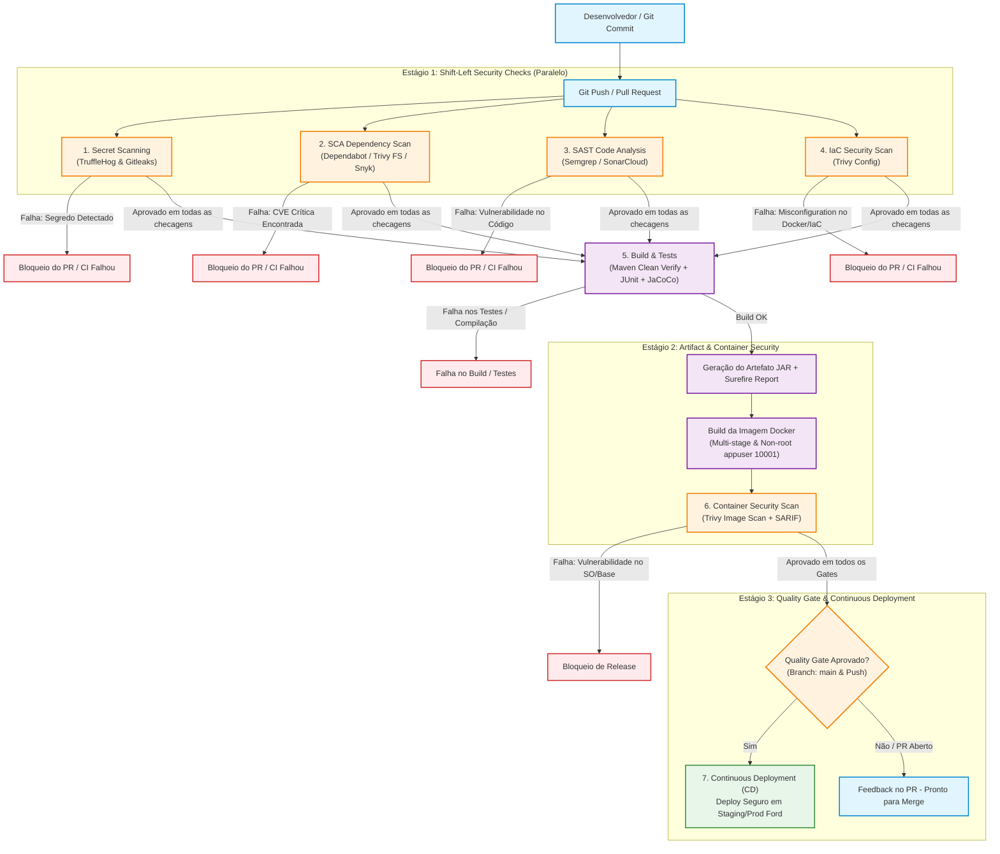

# Specvora Service — Pipeline DevSecOps Integrado

Este documento detalha o desenho arquitetural, a justificativa técnica e a implementação prática do **Pipeline DevSecOps Integrado** do projeto **Specvora Service**. O objetivo é demonstrar como práticas e ferramentas de segurança são incorporadas em todas as etapas do ciclo de vida do desenvolvimento de software (*Shift-Left Security*), desde o commit inicial do desenvolvedor até o deploy em produção.

---

## 1. Visão Geral e Filosofia Shift-Left

O conceito de **DevSecOps** une Desenvolvimento (Dev), Segurança (Sec) e Operações (Ops). Em modelos tradicionais, a segurança era frequentemente uma auditoria tardia realizada apenas no momento pré-deploy ou em produção — gerando retrabalho custoso e atrasos no lançamento.

Com a abordagem **Shift-Left**:
- A segurança é antecipada para as fases mais iniciais do desenvolvimento (*commit*, *pull request* e *build*).
- O desenvolvedor recebe feedback imediato no próprio fluxo de trabalho (pull request).
- Vulnerabilidades conhecidas em bibliotecas, falhas no código proprietário e credenciais acidentalmente expostas são bloqueadas por **Quality Gates** automáticos antes de atingir qualquer ambiente compartilhado.

```
Tradicional:  [ Dev ] ──────────> [ Ops ] ──────────> [ Sec (Auditoria Tardia) ]
DevSecOps:    [ Dev + Sec ] ───> [ Build + Sec ] ───> [ Ops + Sec ] (Deploy Seguro)
```

---

## 2. Desenho do Pipeline DevSecOps (CI/CD)

O pipeline foi construído sobre o **GitHub Actions** ([`.github/workflows/devsecops.yml`](.github/workflows/devsecops.yml)), integrando verificações de código, dependências, credenciais, infraestrutura como código (IaC), integridade de build e segurança de artefatos.

### Diagrama de Fluxo e Quality Gates



### Representação Textual das Etapas

| Etapa | Ferramenta | Momento | Objetivo Principal | Ação em Caso de Falha |
|---|---|---|---|---|
| **1. Secret Scanning** | **TruffleHog** & **Gitleaks** | Pré-build / PR | Detectar chaves privadas (Firebase, JWT, TLS), strings de conexão (MongoDB) e credenciais vazadas | **Bloqueia o pipeline imediatamente (`exit-code: 1`)** |
| **2. SCA** | **Dependabot**, **Trivy FS** & **Snyk** | Pré-build / PR | Identificar vulnerabilidades conhecidas (CVEs) nas dependências diretas e transitivas do Maven | **Bloqueia se severidade $\ge$ Alta (`exit-code: 1`) e publica SARIF** |
| **3. SAST** | **Semgrep** & **SonarCloud** | Pré-build / PR | Analisar o código Java contra OWASP Top 10 e CWEs (NoSQLi, XSS, tratamento de erros) | **Bloqueia em regras com severidade de erro (`--error`) e publica SARIF** |
| **4. IaC Security** | **Trivy Config** | Pré-build / PR | Analisar configurações de infraestrutura (`Dockerfile`, `docker-compose.yml`) | **Bloqueia em configurações inseguras (`exit-code: 1`)** |
| **5. Build & Tests** | **Maven Wrapper** / **JUnit** | Pós-segurança | Compilar com Java 21, validar testes unitários e de integração (`VehicleSecurityIntegrationTest`) | **Falha o build e exporta relatórios Surefire** |
| **6. Container Scan** | **Docker** & **Trivy** | Pós-build | Escanear a imagem Docker multi-stage (`appuser` 10001) contra vulnerabilidades no SO base | **Bloqueia vulnerabilidades críticas/altas (`exit-code: 1`) e publica SARIF** |
| **7. Continuous Deploy** | **GitHub Actions CD** | Pós-gates (apenas `main`) | Realizar deploy da versão homologada e íntegra | **Deploy impedido se qualquer gate anterior falhar** |

---

## 3. Detalhamento das Etapas e Ferramentas

### 3.1. Secret Scanning (TruffleHog & Gitleaks)

- **O que é:** Verificação automatizada do código-fonte e histórico de commits em busca de segredos acidentalmente commitados, como tokens de API, certificados, chaves privadas e credenciais de banco.
- **Ferramentas utilizadas:**
  - **TruffleHog (`trufflesecurity/trufflehog`):** Scanner de detecção profunda de credenciais e chaves ativas em commits e branches, testando automaticamente a validade criptográfica dos segredos encontrados (`--only-verified`).
  - **Gitleaks (`gitleaks-action`):** Scanner open-source de alta performance integrado ao workflow com o arquivo de configuração [`.gitleaks.toml`](.gitleaks.toml). Ele inspeciona o código atual e o histórico do Git (`fetch-depth: 0`). A *allowlist* é restrita a arquivos estritamente necessários (como scripts de build) e **não isenta segredos em arquivos de configuração como `application.yml`**.
  - **GitGuardian:** Plataforma complementar de monitoramento contínuo em nível organizacional que vigia repositórios na nuvem em tempo real para prevenção contra vazamento de segredos em ecossistemas colaborativos.
- **Relação com o Specvora Service:**
  - O projeto utiliza credenciais do **Firebase Admin SDK** (arquivo JSON com chave privada RSA), chaves assimétricas/simétricas de JWT e string de conexão do **MongoDB** (`MONGODB_URI`).
  - As regras e detectores do TruffleHog e Gitleaks impedem que chaves privadas (`BEGIN PRIVATE KEY`), tokens e URIs do MongoDB com usuário e senha em texto plano sejam commitados acidentalmente.

### 3.2. SCA — Software Composition Analysis (Dependabot, Trivy & Snyk)

- **O que é:** Análise automatizada das bibliotecas e dependências de terceiros listadas no gerenciador de pacotes (`pom.xml`). O SCA garante que componentes de código aberto não introduzam vulnerabilidades conhecidas (CVEs/NVD) para o ecossistema.
- **Ferramentas utilizadas:**
  - **Dependabot ([`.github/dependabot.yml`](.github/dependabot.yml)):** Monitora semanalmente o arquivo `pom.xml` e as GitHub Actions do projeto, abrindo Pull Requests automáticos com o bump de versões seguras.
  - **Trivy FS (`aquasecurity/trivy-action`):** Scanner open-source integrado nativamente com `exit-code: 1` para severidades `CRITICAL,HIGH` (com `ignore-unfixed: true`), gerando relatório em formato SARIF exportado para a aba **Security > Code scanning** do GitHub.
  - **Snyk (`snyk/actions/maven`):** Análise profunda opcional de dependências diretas e transitivas ativada com segurança via variável de ambiente de job (`env: SNYK_TOKEN`), sem invalidar o workflow quando o segredo não estiver configurado.
- **Relação com o Specvora Service:**
  - Protege bibliotecas críticas como `bucket4j-core` (usada no rate limiting), `firebase-admin` (autenticação), `spring-boot-starter-security`, `java-jwt` e drivers do `mongodb`.

### 3.3. SAST — Static Application Security Testing (Semgrep & SonarCloud)

- **O que é:** Análise estática do código-fonte proprietário sem necessidade de executar a aplicação. Busca padrões de código vulneráveis, má utilização de APIs, injeções e falhas de criptografia.
- **Ferramentas utilizadas:**
  - **Semgrep:** Scanner semântico leve e declarativo executado diretamente no pipeline (`semgrep/semgrep`). Utiliza os pacotes de regras oficiais `p/owasp-top-ten` e `p/java` com o parâmetro `--error` para falhar em achados críticos e gerar output SARIF.
  - **SonarCloud / SonarQube:** Plataforma corporativa de inspeção contínua de qualidade de código (*Clean Code*), mapeando *Security Hotspots*, cobertura de testes e dívida técnica.
- **Relação com o Specvora Service:**
  - Verifica se não existem concatenações manuais de queries MongoDB (garantindo o uso exclusivo de `MongoTemplate` com `Criteria` parametrizada contra NoSQL Injection).
  - Garante ausência de sanitizações incompletas em DTOs, sanitização de chaves de mapas no MongoDB (`categories`), e valida o tratamento de exceções (evitando vazamento de stack traces).

### 3.4. IaC & Container Security (Docker & Trivy)

- **O que é:** Análise de vulnerabilidades na infraestrutura como código (IaC) e na imagem de container gerada para distribuição da aplicação.
- **Práticas aplicadas no projeto:**
  - **Dockerfile Multi-Stage real:** Estágio de build isolado (`eclipse-temurin:21-jdk-jammy`) gerando o JAR via Maven e estágio final enxuto com apenas JRE 21 (`eclipse-temurin:21-jre-jammy`).
  - **Execução como usuário não-root:** Criação e uso estrito do usuário `appuser` (UID/GID 10001) para cumprir o princípio do menor privilégio, impedindo que um invasor obtenha permissões de root no host em caso de container breakout.
  - **Exec Form e Healthcheck:** `ENTRYPOINT ["java", "-jar", "/app/app.jar"]` para recepção direta de sinais de encerramento (`SIGTERM`/`SIGINT`) pela JVM, e `HEALTHCHECK` periódico.
  - **Scan de IaC (`trivy config`):** Varre arquivos de configuração de infraestrutura (`Dockerfile`, `docker-compose.yml`) buscando misconfigurations antes do build.
  - **Scan de Container (`trivy image`):** Analisa a imagem construída procurando CVEs no SO antes de autorizar o envio ao registro de containers, gerando arquivo SARIF.

### 3.5. Deploy Contínuo com Quality Gate (CD)

- **O que é:** Automação da entrega de software garantindo que nenhum deploy ocorra a menos que todos os critérios de qualidade e segurança sejam satisfeitos.
- **Funcionamento:**
  - O job `deploy` possui dependência estrita de todos os estágios anteriores: `needs: [secret-scanning, sca, sast, iac-scan, build-and-test, container-security]`.
  - Executado apenas na branch `main` e em eventos de `push` (ou merges de PR aprovados).
  - Se qualquer ferramenta anterior reportar uma vulnerabilidade bloqueante ou teste com falha, o pipeline é interrompido imediatamente (*circuit breaker* de segurança).

---

## 4. Política de Quality Gates e Severidade

Para que a segurança não se torne um gargalo e mantenha a previsibilidade, as vulnerabilidades são classificadas por severidade de acordo com o padrão **CVSS** (Common Vulnerability Scoring System):

| Severidade | CVSS Score | Critério no Pipeline | Ação Requerida |
|---|---|---|---|
| **Crítica (Critical)** | 9.0 – 10.0 | **Bloqueio Total** do PR e Deploy (`exit-code: 1`) | Correção imediata ou atualização de biblioteca obrigatória |
| **Alta (High)** | 7.0 – 8.9 | **Bloqueio** do Deploy em Produção | Deve ser corrigido antes da liberação da release |
| **Média (Medium)** | 4.0 – 6.9 | Alerta no relatório / Warning SARIF | Backlog de melhorias técnicas / próximo sprint |
| **Baixa (Low)** | 0.1 – 3.9 | Informativo / Sugestão | Acompanhamento contínuo |

---

## 5. Como Executar os Scans de Segurança Localmente

O desenvolvedor pode e deve rodar as mesmas ferramentas na sua máquina antes de enviar o código (*Pre-commit*):

### A. Executar Gitleaks localmente
```bash
docker run --rm -v ${PWD}:/path zricethezav/gitleaks:latest detect --source="/path" -v --config="/path/.gitleaks.toml"
```

### B. Executar Semgrep (SAST) localmente
```bash
docker run --rm -v "${PWD}:/src" semgrep/semgrep semgrep scan --config "p/owasp-top-ten" --config "p/java" --error
```

### C. Executar Trivy (SCA & IaC) localmente
```bash
# Scan de dependências do diretório (SCA)
docker run --rm -v "${PWD}:/root" aquasec/trivy:latest fs /root --severity CRITICAL,HIGH

# Scan de configuração de infraestrutura (IaC)
docker run --rm -v "${PWD}:/root" aquasec/trivy:latest config /root
```

### D. Scan da imagem Docker após build
```bash
docker build -t specvora-service:local .
docker run --rm -v /var/run/docker.sock:/var/run/docker.sock aquasec/trivy:latest image specvora-service:local --severity CRITICAL,HIGH
```

---

## 6. Configuração no GitHub

Para habilitar a integração completa em repositório GitHub:
1. Navegue até o repositório em **Settings > Secrets and variables > Actions**.
2. Adicione os seguintes secrets caso utilize serviços externos:
   - `SNYK_TOKEN`: Token obtido em [snyk.io](https://snyk.io) (o workflow utiliza Trivy FS automaticamente e ignora o passo do Snyk com segurança se o token não for fornecido).
   - `SONAR_TOKEN`: Token do SonarCloud para análise corporativa (opcional).
3. Habilite **Dependency Graph** e **Dependabot alerts** em **Settings > Code security and analysis**.
4. O GitHub Actions executará automaticamente o workflow [`.github/workflows/devsecops.yml`](.github/workflows/devsecops.yml) a cada push ou pull request na branch `main`.
5. Os relatórios gerados via SARIF são indexados automaticamente na aba **Security > Code scanning**.

---

## 7. Execução do Pipeline no Projeto Ford

No ecossistema corporativo da **Ford** (englobando engenharia de manufatura, frotas conectadas e serviços de brigada de emergência), a governança do ciclo de vida de software segue rigorosos padrões de conformidade e segurança da informação:

```
[ feature/* ] ──PR──> [ develop ] ──────> [ release/* ] ──────> [ main ]
      │                     │                     │                  │
   Gates 1-4           Deploy DEV              Deploy HML         Deploy PRD
(Gitleaks/SCA/        (Automático)         (Aprovação Gestor)   (Aprovação Dupla:
  SAST/Build)                                                  AppSec + Gestor)
```

### 7.1. Fluxo de Branches e Ambientes

1. **`feature/*` $\to$ PR para `develop`:**
   - **Quality Gates Obrigatórios:** Execução automática dos jobs de Secret Scanning (`Gitleaks`), SCA (`Trivy FS`), SAST (`Semgrep`) e Build/Testes (`JUnit 5`, `JaCoCo`).
   - O merge só é autorizado com todas as checagens com status verde e aprovação de pelo menos um peer reviewer.
2. **`develop` $\to$ Deploy em DEV (Ambiente de Desenvolvimento Ford):**
   - Disparo automático de deploy no cluster Kubernetes/OpenShift corporativo da Ford (namespace `ford-dev`).
   - Smoke tests e testes de integração com banco de dados MongoDB homologado.
3. **`release/*` $\to$ Deploy em HML (Homologação / Staging):**
   - Criação de release branch para testes integrados de ponta a ponta com sistemas de telemetria automotiva.
   - Deploy controlado via **GitHub Environment `hml`**, exigindo aprovação formal do **Gestor Técnico da Squad**.
4. **`main` $\to$ Deploy em PRD (Produção Ford):**
   - Deploy em produção via **GitHub Environment `production`**.
   - Exige **aprovação dupla obrigatória** (Líder Técnico/Gestor + Especialista de Segurança da Informação / AppSec).
   - Assinatura criptográfica da imagem de container via **Cosign / Sigstore** e validação de janela de mudança (Change Advisory Board - CAB).

### 7.2. Responsáveis e SLAs de Correção de Vulnerabilidades

A matriz de severidade define os prazos máximos para saneamento de falhas reportadas pelas ferramentas do pipeline:

| Severidade | Responsável | SLA Máximo | Procedimento em Caso de Exceção |
|---|---|---|---|
| **Crítica (Critical)** | Time de Engenharia + AppSec | **48 horas** | Bloqueio imediato do deploy. Exceção temporária somente mediante *Risk Acceptance* formal assinado pelo CISO corporativo. |
| **Alta (High)** | Squad de Desenvolvimento | **7 dias** | Inclusão prioritária na sprint corrente. Falha de gate em PRD. |
| **Média (Medium)** | Squad de Desenvolvimento | **30 dias** | Registro em backlog de segurança e correção na release subsequente. |
| **Baixa (Low)** | Squad de Desenvolvimento | **90 dias** | Monitoramento e atualização via ciclos normais de manutenção e Dependabot. |

### 7.3. Integrações Corporativas Ford

- **Registro Corporativo de Imagens:** As imagens são publicadas em registry privado corporativo (ex.: JFrog Artifactory / Azure Container Registry / AWS ECR), sendo assinadas criptograficamente via chave pública/privada corporativa (`cosign sign`).
- **Gestão de Segredos:** Nenhuma credencial trafega em código ou variáveis estáticas. Em produção, a aplicação consome segredos diretamente do **HashiCorp Vault** / **Azure Key Vault** por meio de injeção dinâmica em tempo de execução via CSI Secrets Store Driver.
- **Visibilidade de Segurança (SIEM/SOC):** Os relatórios gerados em formato SARIF alimentam o painel de Code Scanning do GitHub Enterprise e são exportados via webhook para o SIEM corporativo da Ford (Splunk / Microsoft Sentinel) para auditoria contínua do time de SOC.

### 7.4. Exemplo de Execução Ponta a Ponta

1. Um engenheiro abre o PR `feat/telemetria-frota` ramificado a partir de `develop`.
2. O desenvolvedor cometeu acidentalmente um arquivo com string de conexão de teste contendo credenciais.
3. **Gate 1 (TruffleHog & Gitleaks):** Interrompe o workflow em menos de 15 segundos, apontando o segredo exposto e bloqueando o botão de merge.
4. O desenvolvedor remove o arquivo, reescreve o commit e sobe novamente a alteração.
5. **Gates 2 e 3 (SCA e SAST):** O Semgrep valida que não há injeções NoSQL e o Trivy FS valida o `pom.xml`.
6. **Gate 4 (Build & Testes):** Compila o código Java 21 e executa 100% dos testes unitários e de integração (`VehicleSecurityIntegrationTest`).
7. O PR é aprovado pelo Gestor, mergeado em `develop` e promovido para homologação após validação dos stakeholders de engenharia de frotas.

---

## 8. Arquitetura de Segurança MQTT/TLS para IoT (Projeto Ford)

No ecossistema automotivo Ford, além da camada REST HTTP para gestão de dados, veículos e sensores de pátio (sensores de temperatura, telemetria e rastreadores de veículos) comunicam-se via protocolo de mensagens leves **MQTT** com rigoroso isolamento e criptografia.

```
┌─────────────────────────────────┐                 ┌───────────────────────────────┐
│     Sensores / Veículos IoT     │                 │   Serviço Specvora Backend    │
│  (Certificado X.509 Individual) │                 │ (Spring Boot / Paho Factory)  │
└────────────────┬────────────────┘                 └───────────────▲───────────────┘
                 │                                                  │
                 │ mTLS (Porta 8883)                                │ TLS (Porta 8883)
                 │ Tópico: ford/sensores/%u/telemetria              │ Tópico: ford/sensores/+/telemetria
                 ▼                                                  │
       ┌────────────────────────────────────────────────────────────┴────────┐
       │              Broker MQTT Mosquitto (Hardened / TLS 1.2+)            │
       │  • Porta 1883 Desabilitada                                          │
       │  • mTLS Obrigatório (require_certificate true)                      │
       │  • Autenticação por CN de Certificado (use_identity_as_username)   │
       │  • ACLs Estritas por Tópico e Perfil de Acesso                      │
       └─────────────────────────────────────────────────────────────────────┘
```

### 8.1. Broker Mosquitto com TLS 1.2+ e mTLS

A comunicação com o broker central Mosquitto é configurada para rejeitar texto plano (porta 1883 desativada) e operar exclusivamente sobre a porta segura **8883** com **Mutual TLS (mTLS)**:

```conf
# /mosquitto/config/mosquitto.conf
listener 8883
protocol mqtt

# Criptografia em trânsito
tls_version tlsv1.2
cafile   /mosquitto/certs/ca-ford-corp.crt
certfile /mosquitto/certs/server.crt
keyfile  /mosquitto/certs/server.key

# mTLS: Cada dispositivo/sensor deve apresentar seu próprio certificado X.509
require_certificate true
use_identity_as_username true
allow_anonymous false

# Controle de acesso baseado em listas (ACL)
acl_file /mosquitto/config/acl
```

### 8.2. Controle de Acesso por Tópico e Perfil (ACL)

As políticas de acesso segregam publicadores (dispositivos IoT) de consumidores (backend e painéis de gestão), impedindo que um sensor espione dados de outro:

```conf
# /mosquitto/config/acl

# 1. Dispositivos e sensores IoT: permissão de escrita restrita ao seu próprio CN/UID
pattern write ford/sensores/%u/telemetria

# 2. Backend Specvora: permissão de leitura em todas as telemetrias de sensores
user specvora-backend
topic read ford/sensores/+/telemetria

# 3. Aplicativo de Monitoramento: escuta canais de alerta operacionais
user monitor-app
topic read ford/alertas/#

# 4. Painel de Gestão: leitura de relatórios agregados e telemetria
user gestor-dashboard
topic read ford/metricas/#
```

### 8.3. Cliente Spring Integration / Paho MQTT com TLS

No código do backend Spring Boot, a conexão ao broker MQTT utiliza `MqttPahoClientFactory` com `SSLSocketFactory` gerenciado e verificação estrita de hostname contra ataques Man-in-the-Middle (MITM):

```java
@Configuration
public class MqttSecurityConfig {

    @Bean
    public MqttPahoClientFactory mqttClientFactory(SSLSocketFactory sslSocketFactory,
                                                   @Value("${mqtt.username}") String mqttUser,
                                                   @Value("${mqtt.password}") String mqttPass) {
        MqttConnectOptions options = new MqttConnectOptions();
        options.setServerURIs(new String[]{"ssl://mqtt.ford.local:8883"});
        options.setSocketFactory(sslSocketFactory); // Valida CA da Ford e envia certificado do cliente
        options.setHttpsHostnameVerificationEnabled(true); // Previne MITM
        options.setUserName(mqttUser);
        options.setPassword(mqttPass.toCharArray()); // Injetado via Vault ou LocalEncryptionService
        options.setCleanSession(true);
        options.setAutomaticReconnect(true);

        DefaultMqttPahoClientFactory factory = new DefaultMqttPahoClientFactory();
        factory.setConnectionOptions(options);
        return factory;
    }
}
```

### 8.4. Criptografia em Trânsito HTTP (HTTPS/TLS) na API

Para garantir proteção integral ponta a ponta da camada de comunicação HTTP, a API pode ser configurada com certificados TLS 1.3 / 1.2 nativos no `application.yml`:

```yaml
server:
  port: 8443
  ssl:
    enabled: true
    bundle: api-tls
  http2:
    enabled: true

spring:
  ssl:
    bundle:
      pem:
        api-tls:
          keystore:
            certificate: ${TLS_CERT_PATH:/etc/ssl/certs/api-cert.pem}
            private-key: ${TLS_KEY_PATH:/etc/ssl/certs/api-key.pem}
          options:
            enabled-protocols: TLSv1.3,TLSv1.2
```

Essa especificação garante que todos os dados veiculares e telemetrias transitando entre sensores, brokers e clientes REST contem com garantia de autenticidade, integridade e confidencialidade.
