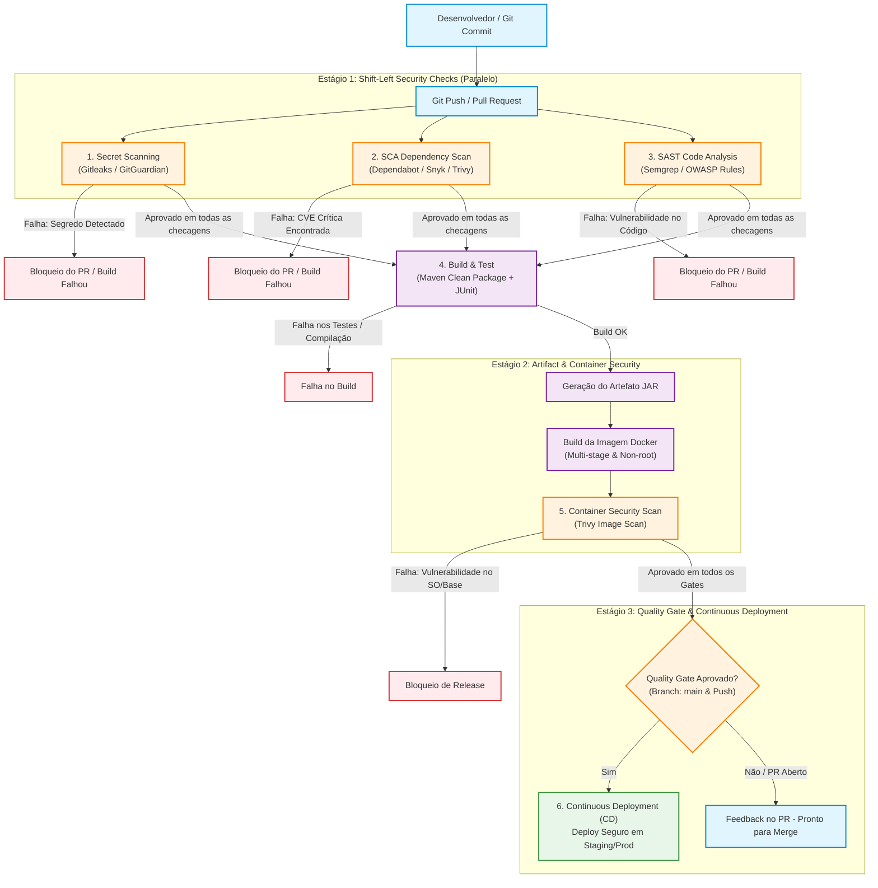

# Specvora Service — Pipeline DevSecOps Integrado

Este documento detalha o desenho arquitetural, a justificativa técnica e a implementação prática do **Pipeline DevSecOps Integrado** do projeto **Specvora Service**. O objetivo é demonstrar como práticas e ferramentas de segurança são incorporadas em todas as etapas do ciclo de vida do desenvolvimento de software (*Shift-Left Security*), desde o commit inicial do desenvolvedor até o deploy em produção.

---

## 1. Visão Geral e Filosofia Shift-Left

O conceito de **DevSecOps** une Desenvolvimento (Dev), Segurança (Sec) e Operações (Ops). Em modelos tradicionais, a segurança era frequentemente uma auditoria tardia realizada apenas no momento pré-deploy ou em produção — gerando retrabalho custoso e atrasos no lançamento.

Com a abordagem **Shift-Left**:
- A segurança é antecipada para as fases mais iniciais do desenvolvimento (*commit*, *pull request* e *build*).
- O desenvolvedor recebe feedback imediato no próprio fluxo de trabalho (pull request).
- Vulnerabilidades conhecidas em bibliotecas, falhas no código proprietário e credenciais acidentalmente expostas são bloqueadas por **Quality Gates** automáticos antes de atingir qualquer ambiente compartilhado.

```
Tradicional:  [ Dev ] ──────────> [ Ops ] ──────────> [ Sec (Auditoria Tardia) ]
DevSecOps:    [ Dev + Sec ] ───> [ Build + Sec ] ───> [ Ops + Sec ] (Deploy Seguro)
```

---

## 2. Desenho do Pipeline DevSecOps (CI/CD)

O pipeline foi construído sobre o **GitHub Actions** (`.github/workflows/devsecops.yml`), integrando verificações de código, dependências, credenciais, integridade de build e segurança de artefatos.

### Diagrama de Fluxo e Quality Gates



### Representação Textual das Etapas

| Etapa | Ferramenta | Momento | Objetivo Principal | Ação em Caso de Falha |
|---|---|---|---|---|
| **1. Secret Scanning** | **Gitleaks** & **GitGuardian** | Pré-build / PR | Detectar chaves privadas (Firebase), strings de conexão (MongoDB) e senhas | **Bloqueia o pipeline imediatamente** |
| **2. SCA** | **Dependabot** & **Snyk** / **Trivy** | Pré-build / PR | Identificar vulnerabilidades conhecidas (CVEs) no `pom.xml` | **Bloqueia se severidade $\ge$ Alta** |
| **3. SAST** | **Semgrep** & **SonarQube** | Pré-build / PR | Analisar o código Java contra OWASP Top 10 e CWEs | **Bloqueia em erros de segurança** |
| **4. Build & Tests** | **Maven Wrapper** / **JUnit** | Pós-segurança | Compilar código Java 21 e validar testes unitários da aplicação | **Falha o build** |
| **5. Container Scan** | **Docker** & **Trivy** | Pós-build | Escanear a imagem Docker contra vulnerabilidades de SO | **Alerta / Bloqueia vulnerabilidades críticas** |
| **6. Continuous Deploy** | **GitHub Actions CD** | Pós-gates (apenas `main`) | Realizar deploy da versão homologada e íntegra | **Deploy impedido se qualquer gate falhar** |

---

## 3. Detalhamento das Etapas e Ferramentas

### 3.1. Secret Scanning (Gitleaks & GitGuardian)

- **O que é:** Verificação automatizada do código-fonte e histórico de commits em busca de segredos acidentalmente commitados, como tokens de API, certificados, chaves privadas e credenciais de banco.
- **Ferramentas utilizadas:**
  - **Gitleaks (`gitleaks-action`):** Scanner open-source de alta performance integrado ao workflow com o arquivo de configuração [.gitleaks.toml](file:///.gitleaks.toml). Ele inspeciona tanto o código atual quanto o histórico do git (`fetch-depth: 0`).
  - **GitGuardian:** Plataforma complementar de monitoramento em tempo real que monitora repositórios públicos e privados contra vazamento de credenciais na nuvem.
- **Relação com o Specvora Service:**
  - O projeto utiliza credenciais do **Firebase Admin SDK** (arquivo JSON com chave privada RSA) e string de conexão do **MongoDB** (`MONGODB_URI`).
  - A regra customizada em `.gitleaks.toml` impede que chaves privadas (`BEGIN PRIVATE KEY`) e URIs do MongoDB com usuário e senha em texto plano sejam commitados acidentalmente.

### 3.2. SCA — Software Composition Analysis (Dependabot & Snyk)

- **O que é:** Análise automatizada das bibliotecas e dependências de terceiros listadas no gerenciador de pacotes (`pom.xml`). Mais de 80% do código de uma aplicação moderna é composto por bibliotecas open-source; o SCA garante que essas dependências não tragam vulnerabilidades conhecidas (CVEs/NVD) para o ecossistema.
- **Ferramentas utilizadas:**
  - **Dependabot (`.github/dependabot.yml`):** Monitora semanalmente o arquivo `pom.xml` e as próprias GitHub Actions do projeto. Ao detectar versões desatualizadas ou vulneráveis, abre Pull Requests automáticos com o bump da versão segura.
  - **Snyk (`snyk/actions/maven`):** Realiza uma varredura aprofundada nas dependências diretas e transitivas do Maven, avaliando o grafo de dependências e indicando o caminho de correção (*fix path*).
  - **Trivy (`aquasecurity/trivy-action`):** Scanner open-source que complementa o Snyk sem depender de limites de cota de SaaS externo, analisando o sistema de arquivos e o `pom.xml` diretamente no runner.
- **Relação com o Specvora Service:**
  - Protege bibliotecas críticas como `bucket4j-core` (usada no rate limiting), `firebase-admin` (autenticação), `spring-boot-starter-security` e drivers do `mongodb`.

### 3.3. SAST — Static Application Security Testing (Semgrep & SonarQube)

- **O que é:** Análise estática do código-fonte proprietário sem necessidade de executar a aplicação. Busca padrões de código vulneráveis, má utilização de APIs, injeções e falhas de criptografia.
- **Ferramentas utilizadas:**
  - **Semgrep:** Scanner semântico leve e declarativo executado diretamente no pipeline (`semgrep/semgrep`). Utiliza os pacotes de regras oficiais `p/owasp-top-ten` e `p/java`.
  - **SonarQube / SonarCloud:** Plataforma de inspeção contínua de qualidade e segurança de código (*Clean Code*), mapeando *Security Hotspots*, vulnerabilidades e dívida técnica através do plugin Maven.
- **Relação com o Specvora Service:**
  - Verifica se não existem concatenações manuais de queries MongoDB (garantindo o uso exclusivo de `MongoTemplate` com `Criteria` parametrizada contra NoSQL Injection).
  - Garante ausência de sanitizações incompletas em DTOs e valida o tratamento de exceções (evitando vazamento de stack traces).

### 3.4. Container Security & Hardening (Docker & Trivy)

- **O que é:** Análise de vulnerabilidades na imagem de container gerada para distribuição da aplicação, cobrindo bibliotecas do sistema operacional base (Linux) e a camada de execução Java.
- **Práticas aplicadas no projeto:**
  - Criação do [Dockerfile](file:///Dockerfile) seguro baseado em imagem oficial Eclipse Temurin (`eclipse-temurin:21-jre-jammy`).
  - **Execução como usuário não-root:** Criação do usuário `appuser` (UID 10001) para cumprir o princípio do menor privilégio, impedindo que um invasor obtenha permissões de root no host caso consiga escapar da aplicação.
  - **Varredura com Trivy:** Analisa a imagem construída procurando CVEs no SO antes de autorizar o envio ao registro de containers.

### 3.5. Deploy Contínuo com Quality Gate (CD)

- **O que é:** Automação da entrega de software garantindo que nenhum deploy ocorra a menos que todos os critérios de qualidade e segurança sejam satisfeitos.
- **Funcionamento:**
  - O job `deploy` possui dependência estrita (`needs: [secret-scanning, sca, sast, build-and-test, container-security]`).
  - Executado apenas na branch `main` e em eventos de `push` (ou merges de PR aprovados).
  - Caso qualquer ferramenta anterior reporte uma vulnerabilidade bloqueante, o pipeline é interrompido (*circuit breaker* de segurança).

---

## 4. Política de Quality Gates e Severidade

Para que a segurança não se torne um gargalo, as vulnerabilidades são classificadas por severidade de acordo com o padrão **CVSS** (Common Vulnerability Scoring System):

| Severidade | CVSS Score | Critério no Pipeline | Ação Requerida |
|---|---|---|---|
| **Crítica (Critical)** | 9.0 – 10.0 | **Bloqueio Total** do PR e Deploy | Correção imediata ou atualização de biblioteca obrigatória |
| **Alta (High)** | 7.0 – 8.9 | **Bloqueio** do Deploy em Produção | Deve ser corrigido antes da liberação da release |
| **Média (Medium)** | 4.0 – 6.9 | Alerta no relatório / Warning | Backlog de melhorias técnicas |
| **Baixa (Low)** | 0.1 – 3.9 | Informativo / Sugestão | Acompanhamento contínuo |

---

## 5. Como Executar os Scans de Segurança Localmente

O desenvolvedor pode e deve rodar as mesmas ferramentas na sua máquina antes de enviar o código (*Pre-commit*):

### A. Executar Gitleaks localmente
```bash
# Via Docker
docker run -v ${PWD}:/path zricethezav/gitleaks:latest detect --source="/path" -v --config="/path/.gitleaks.toml"
```

### B. Executar Semgrep (SAST) localmente
```bash
# Via Docker
docker run --rm -v "${PWD}:/src" semgrep/semgrep semgrep scan --config "p/owasp-top-ten" --config "p/java"
```

### C. Executar Trivy (SCA & Container) localmente
```bash
# Scan de dependências do diretório
docker run --rm -v "${PWD}:/root" aquasec/trivy:latest fs /root

# Scan da imagem docker após build
docker build -t specvora-service:local .
docker run --rm -v /var/run/docker.sock:/var/run/docker.sock aquasec/trivy:latest image specvora-service:local
```

### D. Executar Snyk localmente
```bash
# Com a CLI do Snyk instalada
snyk test --all-projects
```

---

## 6. Configuração no GitHub

Para habilitar a integração completa em repositório GitHub:
1. Navegue até o repositório em **Settings > Secrets and variables > Actions**.
2. Adicione os seguintes secrets caso utilize serviços de nuvem externos:
   - `SNYK_TOKEN`: Token obtido gratuitamente em [snyk.io](https://snyk.io) (o workflow utiliza Trivy automaticamente se o token não for fornecido).
3. Habilite **Dependency Graph** e **Dependabot alerts** em **Settings > Code security and analysis**.
4. O GitHub Actions executará automaticamente o workflow [.github/workflows/devsecops.yml](file:///.github/workflows/devsecops.yml) a cada push ou pull request na branch `main`.
