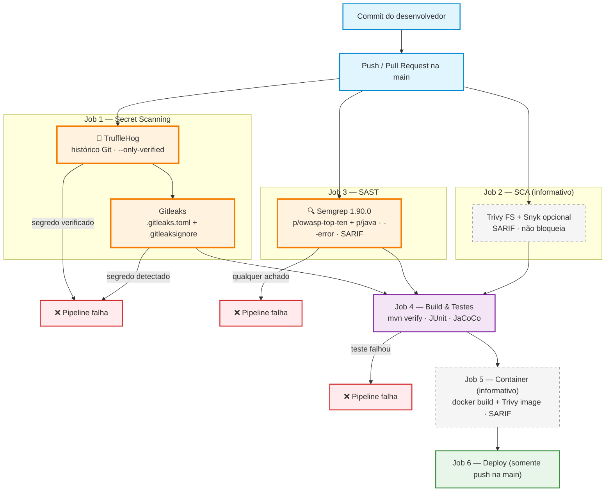

# Specvora Service — Pipeline DevSecOps Integrado

Este documento detalha o desenho arquitetural, a justificativa técnica e a implementação prática do **Pipeline DevSecOps Integrado** do projeto **Specvora Service**. O objetivo é demonstrar como práticas e ferramentas de segurança são incorporadas em todas as etapas do ciclo de vida do desenvolvimento de software (*Shift-Left Security*), desde o commit inicial do desenvolvedor até o deploy em produção.

---

## 1. Visão Geral e Filosofia Shift-Left

O conceito de **DevSecOps** une Desenvolvimento (Dev), Segurança (Sec) e Operações (Ops). Em modelos tradicionais, a segurança era frequentemente uma auditoria tardia realizada apenas no momento pré-deploy ou em produção — gerando retrabalho custoso e atrasos no lançamento.

Com a abordagem **Shift-Left**:
- A segurança é antecipada para as fases mais iniciais do desenvolvimento (*commit*, *pull request* e *build*).
- O desenvolvedor recebe feedback imediato no próprio fluxo de trabalho (pull request).
- Falhas no código proprietário (SAST) e credenciais acidentalmente expostas (Secret Scanning) são bloqueadas por **Quality Gates** automáticos antes de atingir qualquer ambiente compartilhado.

```
Tradicional:  [ Dev ] ──────────> [ Ops ] ──────────> [ Sec (Auditoria Tardia) ]
DevSecOps:    [ Dev + Sec ] ───> [ Build + Sec ] ───> [ Ops + Sec ] (Deploy Seguro)
```

---

## 2. Desenho do Pipeline DevSecOps (CI/CD)

O pipeline roda no **GitHub Actions** ([`.github/workflows/devsecops.yml`](.github/workflows/devsecops.yml)) a cada `push` e `pull_request` na `main`. O foco obrigatório da Etapa 1 são os dois gates **bloqueantes** de análise de código: **Semgrep (SAST)** e **TruffleHog (Secret Scanning)**. SCA e Container Security aparecem no diagrama apenas como **pontos de encaixe informativos** (não bloqueantes), descritos na [seção 4](#4-pesquisa-orientada-sca-e-container-security).

### Diagrama do CI/CD com os pontos de execução do Semgrep e do TruffleHog


```mermaid
flowchart TD
    classDef dev fill:#e1f5fe,stroke:#0288d1,stroke-width:2px;
    classDef gate fill:#fff3e0,stroke:#f57c00,stroke-width:3px;
    classDef info fill:#f5f5f5,stroke:#9e9e9e,stroke-dasharray: 5 5;
    classDef test fill:#f3e5f5,stroke:#7b1fa2,stroke-width:2px;
    classDef deploy fill:#e8f5e9,stroke:#388e3c,stroke-width:2px;
    classDef fail fill:#ffebee,stroke:#d32f2f,stroke-width:2px;

    Dev[Commit do desenvolvedor]:::dev --> Push[Push / Pull Request na main]:::dev

    subgraph J1 ["Job 1 — Secret Scanning"]
        TH["🔑 TruffleHog<br/>histórico Git · --only-verified"]:::gate
        GL["Gitleaks<br/>.gitleaks.toml + .gitleaksignore"]:::gate
    end
    subgraph J3 ["Job 3 — SAST"]
        SG["🔍 Semgrep 1.90.0<br/>p/owasp-top-ten + p/java · --error · SARIF"]:::gate
    end
    subgraph J2 ["Job 2 — SCA (informativo)"]
        TFS["Trivy FS + Snyk opcional<br/>SARIF · não bloqueia"]:::info
    end

    Push --> TH --> GL
    Push --> SG
    Push --> TFS

    TH -->|segredo verificado| X1[❌ Pipeline falha]:::fail
    GL -->|segredo detectado| X1
    SG -->|qualquer achado| X2[❌ Pipeline falha]:::fail

    GL & SG & TFS --> Build["Job 4 — Build & Testes<br/>mvn verify · JUnit · JaCoCo"]:::test
    Build -->|teste falhou| X3[❌ Pipeline falha]:::fail
    Build --> Img["Job 5 — Container (informativo)<br/>docker build + Trivy image · SARIF"]:::info
    Img --> Deploy["Job 6 — Deploy (somente push na main)"]:::deploy
```

| # | Job | Ferramenta | Bloqueia? | Saída |
|---|---|---|---|---|
| 1 | `secret-scanning` | **TruffleHog** v3.97.9 + Gitleaks v2.3.9 | **Sim** — segredo verificado / detectado | Log do job |
| 2 | `sca` | Trivy FS (+ Snyk se houver `SNYK_TOKEN`) | Não (informativo) | SARIF `trivy-fs` |
| 3 | `sast` | **Semgrep** 1.90.0 | **Sim** — `--error` falha com qualquer achado | SARIF `semgrep-sast` |
| 4 | `build-and-test` | Maven + JUnit 5 + JaCoCo | **Sim** — teste falhou | Surefire + relatório JaCoCo |
| 5 | `container-security` | Docker + Trivy image | Não (informativo) | SARIF `trivy-image` |
| 6 | `deploy` | GitHub Actions | Só roda se 1–5 terminarem | — |

---

## 3. Análise de Código: Semgrep e TruffleHog

### 3.1. SAST com Semgrep

- **Execução:** job `sast`, container `semgrep/semgrep:1.90.0`, comando `semgrep scan --config p/owasp-top-ten --config p/java --sarif --error`.
- **Regras aplicadas:** os pacotes oficiais do Semgrep Registry `p/java` (60 regras) e `p/owasp-top-ten` (559 regras, multilinguagem). Sobre os arquivos deste repositório o Semgrep seleciona **96 regras aplicáveis** (Java, YAML, Dockerfile e multilinguagem).
- **Principais famílias de regras e o que verificam no Specvora:**

| Família (prefixo do `rule id`) | Exemplos de regras | Onde se aplica no projeto |
|---|---|---|
| `java.lang.security.audit.crypto.*` | `use-of-aes-ecb`, `gcm-nonce-reuse`, `no-static-initialization-vector`, `use-of-md5`, `use-of-sha1` | `LocalEncryptionService` (AES-256-GCM, IV aleatório por operação) e hashes SHA-256 |
| `java.java-jwt.security.*` | `java-jwt-hardcoded-secret`, `java-jwt-none-alg`, `java-jwt-decode-without-verify` | `JwtTokenService` e `JwtAuthFilter` (HS256 fixo, segredo vindo do ambiente, todo token é verificado) |
| `java.spring.security.injection.*` / `java.spring.security.audit.*` | `tainted-sql-string`, `tainted-system-command`, `tainted-file-path`, `spring-unvalidated-redirect`, `spring-actuator-fully-enabled` | Controllers e `VehicleRepositoryImpl` (consultas MongoDB por `Criteria`, sem concatenação) |
| `java.lang.security.audit.xss.*`, `servletresponse-writer-xss` | `no-direct-response-writer` | `ErrorResponseWriter` (escreve JSON serializado, nunca HTML refletido) |
| `java.lang.security.audit.xxe.*`, `jackson-unsafe-deserialization` | `documentbuilderfactory-disallow-doctype-decl-missing` | Desserialização de corpo JSON (Jackson sem *default typing*) |
| `java.lang.security.audit.crlf-injection-logs` | — | `SecurityAuditLogger` (log em JSON serializado) |
| `yaml.github-actions.security.*` | `run-shell-injection`, `github-actions-mutable-action-tag`, `pull-request-target-code-checkout` | `.github/workflows/devsecops.yml` (actions fixadas por SHA) |
| `dockerfile.security.*`, `yaml.docker-compose.security.*` | `missing-user`, `last-user-is-root`, `privileged-service` | `Dockerfile` (usuário 10001) e `docker-compose.yml` |

- **Achados reais corrigidos durante a Sprint** (varredura local com a mesma versão e as mesmas regras do CI):

| Regra | Arquivo | Correção |
|---|---|---|
| `java-jwt-decode-without-verify` | `JwtAuthFilter.java` | O titular de um token expirado passou a ser obtido com verificação de assinatura, issuer e audience (`JwtTokenService.getSubjectOfExpiredToken`), em vez de `JWT.decode()` |
| `dependabot-missing-cooldown` (2×) | `.github/dependabot.yml` | Adicionado `cooldown.default-days: 7` para não adotar versões recém-publicadas (proteção contra pacotes maliciosos) |

### 3.2. Secret Scanning com TruffleHog

- **Execução:** job `secret-scanning`, action `trufflesecurity/trufflehog` v3.97.9 com `--only-verified`, sobre o histórico Git (`fetch-depth: 0`) entre a branch padrão e o `HEAD`.
- **Como funciona:** mais de 800 detectores reconhecem formatos de credenciais (chaves AWS/GCP, tokens GitHub, URIs MongoDB, chaves privadas etc.) e, para cada candidato, o TruffleHog **tenta autenticar no serviço de origem**. Com `--only-verified`, o gate só falha para segredos confirmadamente válidos, eliminando falsos-positivos.
- **Complemento:** o Gitleaks roda no mesmo job com regras próprias em [`.gitleaks.toml`](.gitleaks.toml) (chave privada de Service Account Firebase, URI MongoDB com senha, `JWT_SECRET`/`AES_SECRET` com valor literal). Exceções só por *fingerprint* em [`.gitleaksignore`](.gitleaksignore).
- **Achados reais** (varredura local de todo o histórico, modo sem `--only-verified`): 2 credenciais **não verificadas** do MongoDB (`specvora:***REMOVED***`), em `README.md` (commit `ac4a419`) e `docker-compose.yml` (commit `5f39f2d`). Ambas eram credenciais de desenvolvimento; foram removidas do código (o `docker-compose.yml` passou a ler segredos do ambiente/`.env`) e devem ser consideradas comprometidas e rotacionadas.

---

## 4. Pesquisa Orientada: SCA e Container Security

Estas práticas **não são exigidas como gate** nesta Sprint; o pipeline as executa em modo informativo (publicam SARIF, não bloqueiam) para mostrar onde entram no ecossistema.

### 4.1. SCA — Software Composition Analysis

- **O que é:** análise das bibliotecas de terceiros declaradas no gerenciador de pacotes (`pom.xml`) contra bases de vulnerabilidades conhecidas (CVE/NVD, GitHub Advisory, OSV). Cobre dependências diretas e **transitivas**, que costumam ser a maior parte do código executado.
- **Por que importa aqui:** o Specvora depende de componentes sensíveis — `spring-boot-starter-security`, `java-jwt`, `firebase-admin`, `bucket4j-core` e o driver MongoDB. Uma CVE em qualquer um deles afeta diretamente autenticação, autorização ou disponibilidade.
- **Onde entra no ecossistema:**
  1. **No IDE / pré-commit** — plugins como Snyk ou Trivy alertam ao adicionar uma dependência.
  2. **No Pull Request** — `trivy fs` / `snyk test` comparam o `pom.xml` do PR com as bases de CVE (job `sca` deste pipeline).
  3. **Continuamente** — o **Dependabot** ([`.github/dependabot.yml`](.github/dependabot.yml)) abre PRs de atualização semanais para Maven e GitHub Actions.
  4. **Em produção** — SBOM (CycloneDX/SPDX) versionado por release, permitindo responder rapidamente “estamos afetados?” quando surge uma nova CVE.
- **Ferramentas de referência:** Dependabot, Trivy, Snyk, OWASP Dependency-Check, Grype.

### 4.2. Container Security

- **O que é:** proteção da imagem que empacota a aplicação e do ambiente onde ela executa: pacotes do sistema operacional base, configuração da imagem e privilégios em tempo de execução.
- **Práticas já aplicadas no [`Dockerfile`](Dockerfile):** build *multi-stage* (JDK só no estágio de build, JRE no final), usuário não-root `appuser` (UID 10001), `ENTRYPOINT` em *exec form*, `HEALTHCHECK` e `no-new-privileges` no `docker-compose.yml`.
- **Onde entra no ecossistema:**
  1. **Build** — scan da imagem (`trivy image`, job `container-security` deste pipeline) contra CVEs do SO base e das bibliotecas empacotadas.
  2. **Registry** — scan contínuo das imagens armazenadas (ECR, ACR, Harbor) e assinatura com Cosign/Sigstore.
  3. **Admissão no cluster** — políticas (Kyverno, OPA Gatekeeper) que recusam imagens não assinadas, com CVE crítica ou rodando como root.
  4. **Runtime** — detecção de comportamento anômalo no container (Falco).
- **Ferramentas de referência:** Trivy, Grype, Docker Scout, Cosign, Falco.

---

## 5. Como Executar as Varreduras Localmente

```bash
# SAST — mesmas regras do CI
docker run --rm -v "${PWD}:/src" semgrep/semgrep:1.90.0 semgrep scan --config p/owasp-top-ten --config p/java --error

# Secret Scanning — todo o histórico Git
docker run --rm -v "${PWD}:/repo" trufflesecurity/trufflehog:3.97.9 git file:///repo --only-verified
docker run --rm -v "${PWD}:/path" zricethezav/gitleaks:v8.24.3 git /path --config /path/.gitleaks.toml -v

# SCA e Container (informativos)
docker run --rm -v "${PWD}:/root" aquasec/trivy:latest fs /root --severity CRITICAL,HIGH
docker build -t specvora-service:local . && \
docker run --rm -v /var/run/docker.sock:/var/run/docker.sock aquasec/trivy:latest image specvora-service:local --severity CRITICAL,HIGH
```

---

## 6. Configuração no GitHub

Para habilitar a integração completa em repositório GitHub:
1. Navegue até o repositório em **Settings > Secrets and variables > Actions**.
2. Adicione os seguintes secrets caso utilize serviços externos:
   - `SNYK_TOKEN`: Token obtido em [snyk.io](https://snyk.io) (o workflow utiliza Trivy FS automaticamente e ignora o passo do Snyk com segurança se o token não for fornecido).
3. Habilite **Dependency Graph** e **Dependabot alerts** em **Settings > Code security and analysis**.
4. O GitHub Actions executará automaticamente o workflow [`.github/workflows/devsecops.yml`](.github/workflows/devsecops.yml) a cada push ou pull request na branch `main`.
5. Os relatórios gerados via SARIF são indexados automaticamente na aba **Security > Code scanning**.

---

---

## 7. Evidências e Resultados das Varreduras

> **Prints do GitHub Actions:** anexar em `docs/evidencias/` as capturas da execução do workflow (visão geral dos jobs, log do job `secret-scanning` e do job `sast`, e a aba **Security > Code scanning** com os SARIF). As saídas abaixo são de execuções reais locais, com as mesmas versões e regras do CI, em 2026-09-26.

### 7.1. Semgrep — antes da correção (3 achados)

```text
$ semgrep scan --config p/owasp-top-ten --config p/java --metrics=off .
  Scanning 68 files tracked by git with 560 Code rules:
  Language      Rules   Files          Origin      Rules
  <multilang>       7      57          Community     560
  java             60      34
  yaml             25       4
  dockerfile        4       1

Ran 96 rules on 57 files: 3 findings.
  package_managers.dependabot.dependabot-missing-cooldown   .github/dependabot.yml:4    MEDIUM
  package_managers.dependabot.dependabot-missing-cooldown   .github/dependabot.yml:17   MEDIUM
  java.java-jwt.security.audit.jwt-decode-without-verify    src/main/java/.../config/JwtAuthFilter.java:139   WARNING
```

### 7.2. Semgrep — depois da correção

```text
$ semgrep scan --config p/owasp-top-ten --config p/java --metrics=off --error .
Ran 96 rules on 57 files: 0 findings.
$ echo $?
0
```

### 7.3. TruffleHog — gate do pipeline (`--only-verified`)

```text
$ trufflehog git file://. --only-verified
trufflehog  finished scanning  {"chunks": 249, "bytes": 436142, "verified_secrets": 0,
            "unverified_secrets": 0, "scan_duration": "10.05s", "trufflehog_version": "3.97.9"}
$ echo $?
0
```

### 7.4. TruffleHog — auditoria completa (inclui não verificados)

```text
$ trufflehog git file://. --json
Detector  Verified  Arquivo              Linha  Commit
MongoDB   false     docker-compose.yml   7      5f39f2d
MongoDB   false     README.md            232    ac4a419
finished scanning  {"verified_secrets": 0, "unverified_secrets": 2}
```

Tratamento: credenciais removidas do código atual, `docker-compose.yml` lendo segredos do ambiente e fingerprints históricos registrados no `.gitleaksignore` após a rotação.
