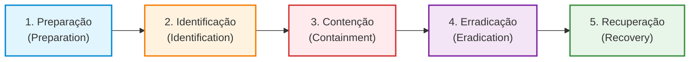

# Specvora Service — Logs, Alertas e Resposta a Incidentes

Este documento formaliza as entregas da **Etapa 3 (Challenge Sprint 3 - Cybersecurity)** para o projeto **Specvora Service**, detalhando a implementação e especificação de **Logs Estruturados de Segurança**, **Plano de Monitoramento e Regras de Alertas (API, Mobile, IoT e ML)** e o **Plano e Fluxo de Resposta a Incidentes baseado no framework SANS PICERL**, contextualizado para o ecossistema corporativo da **Ford** (gestão de frotas, telemetria de sensores e brigada de emergência).

---

## 1. Visão Geral da Arquitetura de Observabilidade e Resposta

A observabilidade com foco em segurança (*Security Observability*) assegura que qualquer evento anômalo, tentativa de intrusão, quebra de integridade ou abuso de recursos seja registrado de forma não repudiável, estruturada e encaminhada em tempo real para correlação em SIEM (Security Information and Event Management) e atuação do SOC (Security Operations Center).

```
┌────────────────────────────────────────────────────────────────────────┐
│                        FONTES DE EVENTOS (TELEMETRIA)                  │
├───────────────┬────────────────┬──────────────────────┬────────────────┤
│ API REST      │ App Mobile     │ Dispositivos IoT     │ Modelos ML     │
│ (Specvora)    │ (Brigada Ford) │ (Sensores de Pátio)  │ (Detecção)     │
└───────┬───────┴────────┬───────┴──────────┬───────────┴────────┬───────┘
        │                │                  │                    │
        ▼                ▼                  ▼                    ▼
┌────────────────────────────────────────────────────────────────────────┐
│             LOGGING ESTRUTURADO JSON + OPEN TELEMETRY / MDC            │
│ (timestamp, event_type, severity, user_id, client_ip, status_code, ...) │
└───────────────────────────────────┬────────────────────────────────────┘
                                    │
                                    ▼
┌────────────────────────────────────────────────────────────────────────┐
│        COLETA E AGREGADOR CENTRALIZADO (FluentBit / Logstash)          │
└───────────────────────────────────┬────────────────────────────────────┘
                                    │
                                    ▼
┌────────────────────────────────────────────────────────────────────────┐
│             SIEM / SOC CORPORATIVO FORD (Splunk / Elastic)             │
│        • Dashboards em Tempo Real    • Correlação de Eventos           │
│        • Gatilhos de Alerta Automáticos (PagerDuty / Slack / Teams)    │
└───────────────────────────────────┬────────────────────────────────────┘
                                    │ Alerta Crítico Disparado
                                    ▼
┌────────────────────────────────────────────────────────────────────────┐
│            RESPOSTA A INCIDENTES — FLUXO SANS PICERL (CSIRT)           │
│    Preparação ──> Identificação ──> Contenção ──> Erradicação ──>      │
│    Recuperação                                                         │
└────────────────────────────────────────────────────────────────────────┘
```

---

## 2. Logs Estruturados de Segurança (JSON)

Para viabilizar indexação em alta performance, auditoria de conformidade (LGPD/ISO 27001) e correlação analítica no SIEM, todos os eventos de segurança do Specvora Service são emitidos em **JSON puro (uma linha por evento)** através do componente [`SecurityAuditLogger.java`](src/main/java/br/com/specvora_service/security/SecurityAuditLogger.java).

### 2.1. Padrão de Schema de Eventos de Auditoria

| Campo | Tipo | Descrição |
|---|---|---|
| `timestamp` | String (ISO-8601 UTC) | Momento exato da ocorrência com precisão de milissegundos |
| `log_type` | String | Identificador fixo de evento de segurança (`SECURITY_AUDIT_EVENT`) |
| `event_type` | String | Código padronizado da ação/evento (ex.: `AUTH_LOGIN_FAILURE`) |
| `severity` | String | Criticidade: `INFO`, `WARN`, `ERROR` ou `CRITICAL` |
| `user_id` | String | Identificador anonimizado do usuário ou `"anonymous"` |
| `client_ip` | String | Endereço IP do solicitante resolvido de forma segura |
| `http_method` | String | Método HTTP da requisição (`GET`, `POST`, `PUT`, `DELETE`) |
| `request_path` | String | Endpoint acessado (`/auth/login`, `/vehicles`, etc.) |
| `status_code` | Integer | Código de status HTTP retornado |
| `message` | String | Descrição compreensível e objetiva do evento |
| `details` | Object | Metadados contextuais adicionais em pares chave-valor |

---

### 2.2. Exemplos Reais de Logs Estruturados por Evento Crítico

#### Exemplo 1: Tentativa de Login Bem-sucedida (`AUTH_LOGIN_SUCCESS`)
```json
{
  "timestamp": "2026-09-25T01:14:02.341Z",
  "log_type": "SECURITY_AUDIT_EVENT",
  "event_type": "AUTH_LOGIN_SUCCESS",
  "severity": "INFO",
  "user_id": "gestor",
  "client_ip": "10.42.18.9",
  "http_method": "POST",
  "request_path": "/auth/login",
  "status_code": 200,
  "message": "Login realizado com sucesso",
  "details": {
    "roles": ["ROLE_GESTOR", "ROLE_USER"],
    "auth_provider": "INTERNAL_BCRYPT"
  }
}
```

#### Exemplo 2: Falha de Autenticação com Credenciais Inválidas (`AUTH_LOGIN_FAILURE`)
```json
{
  "timestamp": "2026-09-25T01:14:15.892Z",
  "log_type": "SECURITY_AUDIT_EVENT",
  "event_type": "AUTH_LOGIN_FAILURE",
  "severity": "WARN",
  "user_id": "admin",
  "client_ip": "187.64.120.33",
  "http_method": "POST",
  "request_path": "/auth/login",
  "status_code": 401,
  "message": "Tentativa de login falhou: credenciais inválidas",
  "details": {
    "username_attempted": "admin",
    "reason": "Hash de senha divergente",
    "attempt_sequence": 3
  }
}
```

#### Exemplo 3: Token JWT Expirado Rejeitado (`AUTH_TOKEN_EXPIRED`)
```json
{
  "timestamp": "2026-09-25T01:15:30.104Z",
  "log_type": "SECURITY_AUDIT_EVENT",
  "event_type": "AUTH_TOKEN_EXPIRED",
  "severity": "WARN",
  "user_id": "user",
  "client_ip": "10.42.18.55",
  "http_method": "GET",
  "request_path": "/vehicles",
  "status_code": 401,
  "message": "Token de autenticação expirado recebido na requisição",
  "details": {
    "issuer": "specvora-service",
    "token_expiration_time": "2026-09-25T01:00:00Z",
    "expired_by_seconds": 930
  }
}
```

#### Exemplo 4: Tentativa de Escalada de Privilégio no Registro (`AUTH_REGISTER_ELEVATED_DENIED`)
```json
{
  "timestamp": "2026-09-25T01:16:02.771Z",
  "log_type": "SECURITY_AUDIT_EVENT",
  "event_type": "AUTH_REGISTER_ELEVATED_DENIED",
  "severity": "WARN",
  "user_id": "anonymous",
  "client_ip": "177.20.98.14",
  "http_method": "POST",
  "request_path": "/auth/register",
  "status_code": 403,
  "message": "Tentativa de auto-registro com perfil elevado bloqueada",
  "details": {
    "requested_role": "ADMINISTRADOR",
    "action": "BLOCKED_BY_RBAC",
    "policy": "Auto-registro público restrito a ROLE_USER"
  }
}
```

#### Exemplo 5: Bloqueio por Estouro de Rate Limit Anti-Força Bruta (`RATE_LIMIT_EXCEEDED`)
```json
{
  "timestamp": "2026-09-25T01:16:45.002Z",
  "log_type": "SECURITY_AUDIT_EVENT",
  "event_type": "RATE_LIMIT_EXCEEDED",
  "severity": "WARN",
  "user_id": "anonymous",
  "client_ip": "187.64.120.33",
  "http_method": "POST",
  "request_path": "/auth/login",
  "status_code": 429,
  "message": "Limite de requisições excedido. Bloqueio temporário ativado.",
  "details": {
    "route_type": "LOGIN_BRUTE_FORCE_PROTECTION",
    "limit_capacity": 5,
    "retry_after_seconds": 60,
    "bucket_key": "ip:187.64.120.33"
  }
}
```

#### Exemplo 6: Violação de Idempotência / Requisição Duplicada (`IDEMPOTENCY_CONFLICT`)
```json
{
  "timestamp": "2026-09-25T01:17:22.450Z",
  "log_type": "SECURITY_AUDIT_EVENT",
  "event_type": "IDEMPOTENCY_CONFLICT",
  "severity": "WARN",
  "user_id": "gestor",
  "client_ip": "10.42.18.9",
  "http_method": "POST",
  "request_path": "/vehicles",
  "status_code": 409,
  "message": "Requisição duplicada interceptada pelo filtro de idempotência",
  "details": {
    "idempotency_key": "f81d4fae-7dec-11d0-a765-00a0c91e6bf6",
    "action": "REJECTED_DUPLICATE"
  }
}
```

#### Exemplo 7: Alteração Crítica — Criação de Veículo no Catálogo (`VEHICLE_CREATED`)
```json
{
  "timestamp": "2026-09-25T01:18:10.112Z",
  "log_type": "SECURITY_AUDIT_EVENT",
  "event_type": "VEHICLE_CREATED",
  "severity": "INFO",
  "user_id": "gestor",
  "client_ip": "10.42.18.9",
  "http_method": "POST",
  "request_path": "/vehicles",
  "status_code": 201,
  "message": "Veículo cadastrado no catálogo com sucesso",
  "details": {
    "vehicle_id": "65f1a2b3c4d5e6f7a8b9c0d1",
    "brand": "Ford",
    "model": "Ranger",
    "version": "XLT",
    "engine": "3.0 V6",
    "year": "2026",
    "categories_keys": ["capacidade_reboque", "tracao_4x4", "equipamento_resgate"]
  }
}
```

#### Exemplo 8: Alteração Crítica — Atualização de Veículo (`VEHICLE_UPDATED`)
```json
{
  "timestamp": "2026-09-25T01:19:40.854Z",
  "log_type": "SECURITY_AUDIT_EVENT",
  "event_type": "VEHICLE_UPDATED",
  "severity": "INFO",
  "user_id": "gestor",
  "client_ip": "10.42.18.9",
  "http_method": "PUT",
  "request_path": "/vehicles/65f1a2b3c4d5e6f7a8b9c0d1",
  "status_code": 200,
  "message": "Veículo atualizado no catálogo",
  "details": {
    "vehicle_id": "65f1a2b3c4d5e6f7a8b9c0d1",
    "brand": "Ford",
    "model": "Ranger",
    "updated_fields": ["engine", "categories"]
  }
}
```

#### Exemplo 9: Alteração Crítica — Exclusão de Veículo (`VEHICLE_DELETED`)
```json
{
  "timestamp": "2026-09-25T01:21:05.620Z",
  "log_type": "SECURITY_AUDIT_EVENT",
  "event_type": "VEHICLE_DELETED",
  "severity": "WARN",
  "user_id": "admin",
  "client_ip": "10.42.18.2",
  "http_method": "DELETE",
  "request_path": "/vehicles/65f1a2b3c4d5e6f7a8b9c0d1",
  "status_code": 204,
  "message": "Veículo excluído do catálogo permanentemente",
  "details": {
    "vehicle_id": "65f1a2b3c4d5e6f7a8b9c0d1",
    "authorized_by": "ROLE_ADMINISTRADOR"
  }
}
```

---

## 3. Plano de Monitoramento, Métricas e Gatilhos de Alertas

O plano de monitoramento cobre as quatro camadas da solução no ecossistema Ford: **API REST**, **Mobile (Aplicativo da Brigada)**, **IoT (Sensores de Pátio e Telemetria)** e **ML (Modelos Preditivos de Anomalia)**.

### Classificação de Severidade de Alertas

- **Sev1 (Crítica):** Ameaça imediata à disponibilidade ou confidencialidade. SLA de resposta: **15 minutos**. Canal: PagerDuty on-call + Chamada de voz automática ao líder de CSIRT.
- **Sev2 (Alta):** Tentativa ativa de invasão ou anomalia severa em fluxo de segurança. SLA de resposta: **1 hora**. Canal: Notificação no canal Slack `#soc-ford-alerts` + PagerDuty.
- **Sev3 (Média):** Desvios de comportamento ou falhas pontuais acima da linha de base. SLA de resposta: **4 horas**. Canal: Card automático no Jira Security Backlog + Alerta Teams.
- **Sev4 (Baixa / Informativo):** Eventos operacionais de rotina. Revisão periódica em relatórios diários do SOC.

---

### 3.1. Matriz de Métricas e Regras de Alerta

| Frente | Métrica Monitorada | Gatilho / Condição de Disparo | Severidade | Ação Automatizada e Canal |
|---|---|---|---|---|
| **API** | `auth_login_failures_per_ip` | $\ge 5$ falhas consecutivas em 1 minuto por IP | **Sev2** | Bloqueio imediato do IP no WAF por 15 min; alerta no Slack `#soc-alerts`. |
| **API** | `http_4xx_rate` | $> 10\%$ de erros 401/403 no tráfego total em 5 min | **Sev2** | Disparo de playbook de inspeção de credenciais; notificação PagerDuty. |
| **API** | `http_5xx_rate` | $> 1\%$ de respostas HTTP 500 em janela de 3 min | **Sev1** | Acionamento imediato do time de SRE/AppSec on-call via PagerDuty. |
| **API** | `api_latency_p99` | Latência p99 $> 1500\text{ms}$ durante 5 minutos consecutivos | **Sev3** | Auto-scaling horizontal de instâncias e aviso no canal de operações. |
| **API** | `vehicle_catalog_scraping` | $> 300$ requisições a `/vehicles` em 1 minuto pelo mesmo token | **Sev2** | Revogação preventiva do token do usuário e notificação ao Gestor. |
| **Mobile** | `refresh_token_anomaly` | $> 50$ tentativas inválidas de refresh token em 5 minutos | **Sev2** | Invalidação de todas as sessões ativas da conta e alerta ao SOC. |
| **Mobile** | `compromised_device_detected` | App envia sinalizador de dispositivo com *root* ou *jailbreak* | **Sev3** | Forçar logout imediato do app e bloquear operações locais. |
| **Mobile** | `app_integrity_failure` | Falha de atestação criptográfica (Google Play Integrity / SafetyNet) | **Sev2** | Rejeição de conexões daquele hash de binário (possível app modificado/tampered). |
| **IoT** | `mqtt_mass_disconnect` | $> 10\%$ dos sensores desconectando do broker em 2 minutos | **Sev1** | Alerta crítico à equipe de infraestrutura de pátio (possível DoS em rádio RF). |
| **IoT** | `mqtt_acl_violation` | $\ge 1$ tentativa de publicação em tópico não autorizado pelo certificado | **Sev2** | Desconexão forçada do ClientID, revogação do certificado no Mosquitto e alerta. |
| **IoT** | `sensor_malformed_payload` | $> 5$ mensagens de telemetria rejeitadas por schema por minuto | **Sev2** | Isolamento do tópico do sensor e aviso à manutenção automotiva. |
| **ML** | `telemetry_anomaly_score` | Score de anomalia de telemetria $> 0.85$ detectado pelo modelo | **Sev2** | Geração de ticket de inspeção preventiva do veículo para a equipe técnica de frotas. |
| **ML** | `adversarial_input_detected` | Valores de entrada fora do limite físico de sensores (ex.: temp $> 2000^\circ\text{C}$) | **Sev2** | Descarte da leitura, isolamento da telemetria e investigação de adulteração de sensor. |
| **ML** | `model_concept_drift` | Desvio estatístico de predições $> 20\%$ em relação à baseline histórica | **Sev3** | Notificação à squad de Engenharia de IA para re-treinamento do modelo. |

---

## 4. Plano e Fluxo de Resposta a Incidentes (SANS PICERL)

O plano de resposta a incidentes do Specvora Service segue rigorosamente o framework consagrado **SANS Institute (PICERL)**, adaptado para conter ameaças como vazamento de segredos, ataques de injeção NoSQL, tentativas de força bruta e invasão de telemetria veicular.



---

### Fase 1: Preparação (Preparation)

O objetivo é assegurar que todas as ferramentas, equipes, acessos e processos estejam prontos antes da ocorrência de um incidente:

1. **Equipe de Resposta (CSIRT Ford):**
   - Composta por: Líder de Resposta a Incidentes (Incident Commander), Especialista AppSec, Engenheiro de Backend, Administrador de Banco de Dados (DBA) e Assessor Jurídico/Privacidade (DPO para conformidade LGPD).
2. **Instrumentação e Logs:**
   - Logging estruturado JSON habilitado em todas as instâncias;
   - Agente de coleta (FluentBit) sincronizando logs com retenção imutável (*WORM - Write Once, Read Many*) por 365 dias para auditoria forense.
3. **Gestão de Segredos e Credenciais:**
   - Todas as chaves e certificados residem no **HashiCorp Vault**, permitindo rotação com um único comando.
4. **Comunicação Segura de Emergência:**
   - Canal out-of-band dedicado (Signal / sala segura de crise Teams) caso a rede corporativa principal seja comprometida.

---

### Fase 2: Identificação (Identification)

Nesta fase, a anomalia é detectada, triada e declarada formalmente como incidente:

1. **Gatilhos de Detecção:**
   - Disparo de alertas automáticos da Seção 3 (ex.: 5 falhas consecutivas de login seguidas de acesso com sucesso a partir de IP estrangeiro);
   - Alerta de secret scanning (TruffleHog / Gitleaks) apontando commit de token em repositório;
   - Relato de anomalia de dados reportado por um Gestor ou Usuário.
2. **Classificação de Impacto:**
   - **P1 (Crítico):** Exfiltração comprovada de base de dados, comprometimento de chave privada RSA/AES ou paralisação total dos serviços da frota.
   - **P2 (Alto):** Ataque de força bruta ativo contra credenciais administrativas ou comprometimento de conta individual.
   - **P3 (Médio):** Tentativa frustrada de exploração de vulnerabilidade (ex.: scanner automático tentando NoSQL injection bloqueado pelo Spring Data).
   - **P4 (Baixo):** Falso-positivo ou varredura genérica de portas na infraestrutura externa.
3. **Abertura do Incidente:**
   - Registro do ticket no sistema de ITSM (Jira Service Management / ServiceNow) e convocação da sala de crise para incidentes P1/P2.

---

### Fase 3: Contenção (Containment)

A contenção impede que o invasor amplie seu raio de alcance e preserva as evidências para posterior análise forense:

#### A. Contenção de Curto Prazo (Ação Imediata — *Stop the Bleeding*)
1. **Isolamento de Credenciais:**
   - Invalidação forçada de todas as sessões ativas do usuário sob suspeita;
   - Se o token JWT comprometido tiver validade residual, adicioná-lo à blacklist em memória / Redis com TTL correspondente ao tempo de expiração (`exp`).
2. **Bloqueio em Borda:**
   - Inserção do IP ou bloco CIDR atacante na regra de negação do WAF / Firewall perimetral;
   - Ativação do modo "Under Attack" no Cloudflare para o subdomínio da API.
3. **Isolamento do Broker IoT:**
   - Revogação imediata do certificado X.509 do sensor comprometido no arquivo de CRL (*Certificate Revocation List*) do Mosquitto.

#### B. Contenção de Longo Prazo e Preservação de Evidências
1. **Preservação Forense:**
   - Criação de snapshot do volume de disco da máquina virtual/container antes de reiniciar ou desligar o nó;
   - Exportação segura de dumps de memória RAM para análise de malware ou chaves em memória;
   - Congelamento dos logs do período no SIEM com assinatura criptográfica para garantir a cadeia de custódia (*Chain of Custody*).
2. **Segregação de Rede:**
   - Aplicação de `NetworkPolicy` no Kubernetes isolando o pod vulnerável, permitindo tráfego somente para a equipe forense.

---

### Fase 4: Erradicação (Eradication)

A erradicação elimina a causa raiz que permitiu o incidente e remove qualquer resquício deixado pelo atacante:

1. **Análise de Causa Raiz (RCA):**
   - Identificação do vetor de entrada (ex.: credential stuffing por senha fraca, exploração de endpoint sem sanitização ou segredo vazado em commit antigo).
2. **Rotação Completa de Segredos e Chaves:**
   - Rotação do `JWT_SECRET` no cofre Vault (invalidando globalmente todos os tokens legados);
   - Rotação da chave `AES_SECRET` do `LocalEncryptionService` e re-criptografia dos dados de auditoria em repouso;
   - Alteração das credenciais de acesso do MongoDB (`specvora` e root);
   - Renovação dos certificados TLS do broker Mosquitto e dos clientes Paho.
3. **Aplicação de Correções no Código:**
   - Desenvolvimento de patch de segurança saneando o endpoint ou reforçando o rate limit;
   - Submissão ao pipeline DevSecOps com validação obrigatória dos scanners **Semgrep**, **TruffleHog** e **Trivy**;
   - Deploy da imagem Docker segura (`appuser` 10001) gerada pelo estágio de build.

---

### Fase 5: Recuperação (Recovery)

A recuperação restaura a operação dos sistemas para o ambiente produtivo de forma segura e monitorada:

1. **Validação de Integridade da Base de Dados:**
   - Execução de rotina de verificação no MongoDB para assegurar que nenhum registro foi adulterado, deletado ou injetado indevidamente;
   - Se necessário, restauração a partir do último backup limpo verificado (*Point-in-Time Recovery*).
2. **Retorno Faseado do Tráfego:**
   - Liberação inicial para tráfego interno (rede corporativa Ford e frotas operacionais prioritárias);
   - Abertura controlada para clientes externos via *Canary Deployment* (10% $\to$ 50% $\to$ 100%).
3. **Monitoramento Reforçado Pós-Incidente:**
   - Janela de vigilância intensiva de **72 horas** em nível `DEBUG` com alertas de sensibilidade elevada configurados no SIEM;
   - Monitoramento contínuo dos tópicos MQTT e do endpoint `/auth/login` para detectar tentativas imediatas de reataque.

---

## 5. Matriz de Contatos de Emergência (CSIRT Ford)

| Papel na Resposta | Responsável | Canal Primário | Canal Secundário (Out-of-band) |
|---|---|---|---|
| **Incident Commander (Líder)** | Gerente de Cybersecurity Ford | PagerDuty (#p1-commander) | Telefone de emergência criptografado |
| **AppSec Lead** | Engenheiro de Segurança da Aplicação | Slack (#appsec-emergency) | Signal corporativo |
| **SRE / Cloud Lead** | Arquiteto de Nuvem & Kubernetes | PagerDuty (#sre-oncall) | Canal rádio de suporte operacional |
| **DBA Lead** | Administrador MongoDB Corporativo | Teams (#db-escalation) | Celular corporativo |
| **DPO / Jurídico** | Encarregado de Proteção de Dados (LGPD) | E-mail seguro (dpo@ford.com) | Telefone corporativo |

---

*(Nota: Conforme as instruções avaliativas da Sprint 3 de Cybersecurity, a fase de Lições Aprendidas não é exigida e foi omitida deste documento).*
