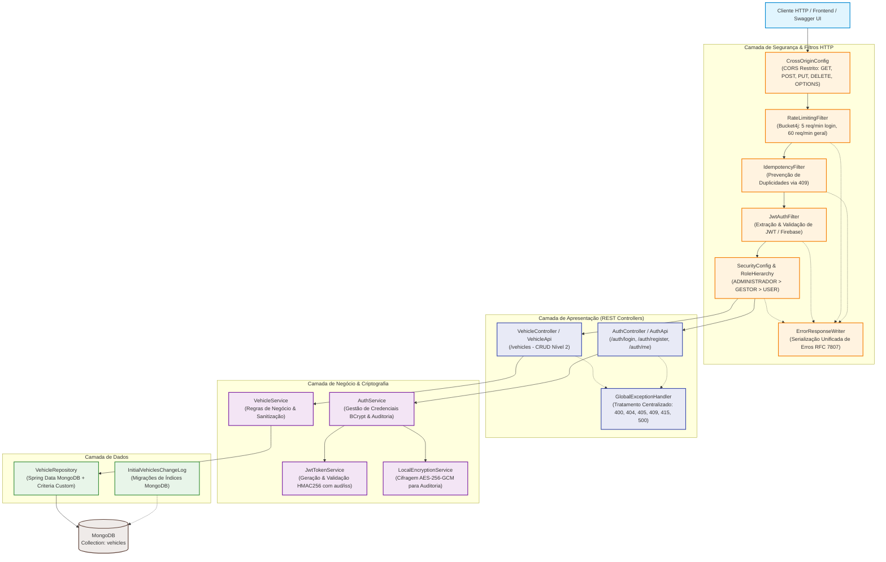
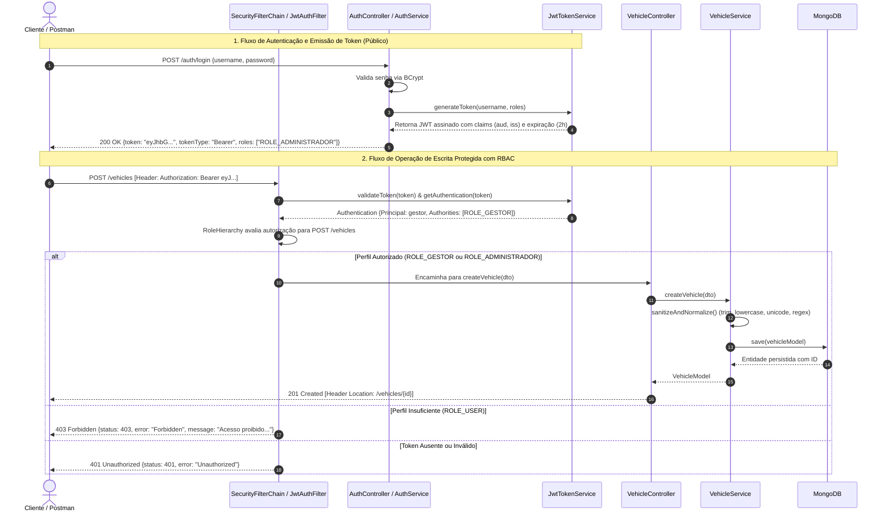

# Specvora Service

> **API RESTful Nível 2** para agregação, consulta e gerenciamento de especificações técnicas de veículos, desenvolvida com Spring Boot, MongoDB, Autenticação JWT com RBAC 3-Tier (`ROLE_USER`, `ROLE_GESTOR`, `ROLE_ADMINISTRADOR`) e Pipeline DevSecOps Integrado.

---

## 1. Arquitetura da Solução

O serviço adota uma arquitetura em camadas bem delimitada, baseada nos princípios de **Clean Architecture** e **SOA (Service-Oriented Architecture)**, garantindo baixo acoplamento e alta coesão:

### 1.1. Diagrama de Componentes e Responsabilidades



### 1.2. Fluxo de Comunicação e Autenticação



### 1.3. Estrutura de Pacotes

```
src/main/java/br/com/specvora_service/
├── auth/                                # Módulo de Autenticação e JWT
│   ├── controller/
│   │   ├── AuthApi.java                 # Contrato e anotações OpenAPI (rotas públicas sem cadeado)
│   │   └── AuthController.java          # REST Controller (/auth)
│   ├── dto/
│   │   ├── LoginRequestDTO.java         # Request de login
│   │   ├── LoginResponseDTO.java        # Resposta com JWT e roles
│   │   ├── RegisterRequestDTO.java      # Request de cadastro com validação
│   │   └── UserResponseDTO.java         # Dados do usuário e perfil
│   └── service/
│       ├── AuthService.java             # Gestão de credenciais (BCrypt), RBAC e auditoria cifrada
│       └── JwtTokenService.java         # Geração e validação de tokens JWT (HS256 com aud/iss)
├── config/                              # Configurações de Infraestrutura e Filtros
│   ├── CrossOriginConfig.java           # Restrição de CORS (GET, POST, PUT, DELETE, OPTIONS)
│   ├── ErrorResponseWriter.java         # Serializador unificado de respostas de erro (RFC 7807)
│   ├── FirebaseConfig.java              # Integração resiliente Firebase Admin
│   ├── IdempotencyFilter.java           # Prevenção de duplicações via header Idempotency-Key (409)
│   ├── JwtAuthFilter.java               # Filtro de autenticação Bearer JWT e propagação de expiração
│   ├── MongoConfig.java                 # Conexão e pool MongoDB
│   ├── OpenApiConfig.java               # Configuração Swagger com BearerAuth
│   ├── RateLimitingFilter.java          # Bucket4j (Rate Limit anti-brute force em /auth/login)
│   └── SecurityConfig.java              # SecurityFilterChain, RoleHierarchy e HTTP Security Headers
├── security/                            # Criptografia e Serviços de Segurança
│   └── LocalEncryptionService.java      # Criptografia autenticada AES-256-GCM para dados em repouso
└── vehicle/                             # Módulo de Domínio de Veículos
    ├── controller/
    │   ├── VehicleApi.java              # Contrato OpenAPI REST Nível 2
    │   └── VehicleController.java       # CRUD REST Controller
    ├── domain/
    │   └── VehicleModel.java            # Entidade mapeada no MongoDB
    ├── dto/
    │   ├── VehicleRequestDTO.java       # DTO para busca parametrizada com regex Unicode
    │   └── VehicleUpsertDTO.java        # DTO para criação e atualização com sanitização NoSQL
    ├── exception/
    │   ├── ErrorResponseDTO.java        # Resposta padronizada de erro RFC 7807
    │   ├── GlobalExceptionHandler.java  # Tratamento centralizado de erros (400, 404, 405, 409, 415, 500)
    │   ├── ResourceConflictException.java# Exceção de conflito de recursos (HTTP 409)
    │   └── VehicleNotFoundException.java# Exceção de negócio para HTTP 404
    ├── migration/
    │   └── InitialVehiclesChangeLog.java# Migrações Mongock
    ├── repository/
    │   ├── VehicleRepository.java       # Spring Data MongoRepository
    │   ├── VehicleRepositoryCustom.java # Assinatura de busca avançada
    │   └── VehicleRepositoryImpl.java   # Implementação segura com Criteria
    └── service/
        └── VehicleService.java          # Regras de negócio, substituição completa PUT e CRUD
```

---

## 2. Autenticação, Autorização e JWT

O Specvora Service oferece um ecossistema seguro de autenticação e controle de acesso baseado em **JWT (JSON Web Token)** com suporte a **RBAC (Role-Based Access Control)** em 3 níveis hierárquicos:

### 2.1. Perfis de Acesso (Roles) e Hierarquia

O Spring Security está configurado com `RoleHierarchy`:
`ROLE_ADMINISTRADOR > ROLE_GESTOR > ROLE_USER`

- **`ROLE_USER`**: Perfil padrão para consumidores e clientes da API. Permite listar veículos (`GET /vehicles`), buscar por ID (`GET /vehicles/{id}`), pesquisar por especificações técnicas (`POST /vehicles/search`) e consultar o próprio perfil (`GET /auth/me`). Não possui permissão para criar, alterar ou apagar veículos (retorna `403 Forbidden`).
- **`ROLE_GESTOR`**: Herda todas as permissões de User e adiciona a capacidade de cadastrar novos veículos (`POST /vehicles`) e atualizar dados existentes (`PUT /vehicles/{id}`).
- **`ROLE_ADMINISTRADOR`**: Perfil com privilégio total. Herda todas as permissões de Gestor, pode excluir veículos (`DELETE /vehicles/{id}`) e possui permissão exclusiva para cadastrar novos usuários com perfis elevados (`GESTOR` ou `ADMINISTRADOR`).

### 2.2. Prevenção de Escalada de Privilégio no Registro

O endpoint de cadastro (`POST /auth/register`) protege a integridade do sistema contra escalada de privilégios:
- O auto-registro anônimo/público atribui exclusivamente o perfil inicial de menor privilégio: **`ROLE_USER`**.
- Caso o payload solicite um perfil elevado (`GESTOR` ou `ADMINISTRADOR`), o serviço valida se o usuário emissor da requisição possui `ROLE_ADMINISTRADOR`. Caso contrário, a requisição é rejeitada com **`403 Forbidden`** (`AccessDeniedException`).
- Tentativas de cadastro com nome de usuário já existente retornam **`409 Conflict`**.

### 2.3. Usuários Pré-configurados para Teste

A aplicação já inicia com três credenciais prontas para validação:

| Usuário | Senha | Perfil Principal | Permissões no Sistema |
|---|---|---|---|
| **`admin`** | `admin123` | **`ROLE_ADMINISTRADOR`** | Total: Leitura, Escrita, Exclusão e Gestão de Usuários |
| **`gestor`** | `gestor123` | **`ROLE_GESTOR`** | Operacional: Leitura, Criação e Edição de Veículos |
| **`user`** | `user123` | **`ROLE_USER`** | Padrão: Somente Leitura e Busca Técnica |

### 2.4. Especificação do JWT

- **Algoritmo:** HMAC256 (`HS256`) fixo e imutável.
- **Entropia da Chave:** Validação obrigatória de no mínimo 256 bits (32 bytes). Caso não seja fornecida no ambiente (`JWT_SECRET`), o serviço gera dinamicamente uma chave criptográfica efêmera com `SecureRandom`.
- **Validade:** 2 horas.
- **Claims incorporadas:**
  - `sub`: Nome do usuário (username).
  - `roles`: Lista de perfis concedidos (ex.: `["ROLE_ADMINISTRADOR"]`).
  - `iss`: `"specvora-service"`.
  - `aud`: `"specvora-api"`.
  - `iat`: Timestamp de emissão.
  - `exp`: Timestamp de expiração (propagado para `/auth/me`).

Recomendação de geração de chave forte em produção:
```bash
export JWT_SECRET="$(openssl rand -base64 48)"
export AES_SECRET="$(openssl rand -base64 32)"
```

---

## 3. Maturidade REST — Nível 2 (Richardson Maturity Model)

A API adota integralmente o **Nível 2** do modelo de maturidade REST, caracterizado por:
1. **Recursos bem definidos em URIs no plural** (`/vehicles`, `/auth`).
2. **Uso semântico estrito dos métodos HTTP** (`GET`, `POST`, `PUT`, `DELETE`).
3. **Status codes coerentes com cada operação**, eliminando qualquer retorno indevido de HTTP 500 para erros originados pelo cliente.

### 3.1. Matriz de Endpoints

| Método | Endpoint | Perfil Mínimo | Sucesso | Erros Mapeados | Descrição |
|---|---|---|---|---|---|
| `POST` | `/auth/login` | Público | `200 OK` | `400`, `401`, `429` | Autentica e emite token JWT com roles |
| `POST` | `/auth/register` | Público | `201 Created` | `400`, `403`, `409` | Cadastra usuário (elevado requer ADMINISTRADOR) |
| `GET` | `/auth/me` | Autenticado | `200 OK` | `401` | Retorna usuário, roles e `expiresAt` do token |
| `GET` | `/vehicles` | `USER` | `200 OK` | `401` | Lista todos os veículos cadastrados |
| `GET` | `/vehicles/{id}` | `USER` | `200 OK` | `401`, `404` | Busca detalhes de um veículo por ID |
| `POST` | `/vehicles/search` | `USER` | `200 OK` | `400`, `401`, `404` | Busca veículo por especificações técnicas |
| `POST` | `/vehicles` | **`GESTOR`** | **`201 Created`** | `400`, `401`, **`403`**, `409` | Cadastra veículo (inclui Header `Location`) |
| `PUT` | `/vehicles/{id}` | **`GESTOR`** | **`200 OK`** | `400`, `401`, **`403`**, `404` | Substituição completa dos dados do veículo |
| `DELETE` | `/vehicles/{id}` | **`ADMINISTRADOR`** | **`204 No Content`** | `401`, **`403`**, `404` | Exclui um veículo do catálogo |

---

## 4. Padronização de Erros e Documentação OpenAPI

### 4.1. Resposta de Erro Padronizada (`ErrorResponseDTO`)

Todas as falhas da API (validação, negócio ou segurança) retornam uma resposta uniforme inspirada no padrão **RFC 7807 (Problem Details)**:

```json
{
  "timestamp": "2026-09-25T03:45:00.123Z",
  "status": 400,
  "error": "Bad Request",
  "message": "Falha na validação dos campos da requisição",
  "path": "/vehicles",
  "fieldErrors": {
    "brand": "Marca é obrigatória",
    "year": "Ano deve ser um valor numérico válido de 4 dígitos entre 1900 e 2099"
  }
}
```

### 4.2. Documentação Interativa com Swagger UI

A documentação interativa da API está disponível em:
👉 **`http://localhost:8080/swagger-ui.html`**

**Como testar pelo Swagger UI:**
1. Execute `POST /auth/login` com usuário `admin` e senha `admin123`.
2. Copie o valor do campo `"token"` retornado.
3. Clique no botão **Authorize** (topo da página).
4. Cole o token e confirme. Todos os endpoints protegidos agora podem ser testados diretamente pela interface.

---

## 5. Testes Automatizados

A suíte de testes cobre comportamentos de negócio, segurança em profundidade e a cadeia completa do Spring Security:

| Classe de Teste | Camada Testada | Cenários Validados |
|---|---|---|
| [`VehicleSecurityIntegrationTest`](src/test/java/br/com/specvora_service/vehicle/VehicleSecurityIntegrationTest.java) | **SecurityFilterChain Real** | Requisição sem token (`401`), token com perfil `USER` tentando POST (`403`), criação com perfil `ADMINISTRADOR`/`GESTOR` (**`201`** com header **`Location`**), e exclusão com `ADMINISTRADOR` (**`204 No Content`**). |
| [`JwtTokenServiceTest`](src/test/java/br/com/specvora_service/auth/JwtTokenServiceTest.java) | Token / Criptografia | Assinatura HMAC256, audiência `specvora-api`, emissor, extração de roles, rejeição de chave fraca, geração de chave efêmera e **rejeição estrita de token expirado**. |
| [`AuthServiceTest`](src/test/java/br/com/specvora_service/auth/AuthServiceTest.java) | Segurança / Negócio | Login com BCrypt, bloqueio de escalada de privilégio (**`403`**), detecção de username duplicado (**`409`**), propagação de `expiresAt` e auditoria cifrada em repouso. |
| [`RateLimitingFilterTest`](src/test/java/br/com/specvora_service/config/RateLimitingFilterTest.java) | Hardening de API | Proteção anti-força bruta na rota `/auth/login` (6ª tentativa bloqueada com **`429`**, `Retry-After` e formato unificado via `ErrorResponseWriter`). |
| [`LocalEncryptionServiceTest`](src/test/java/br/com/specvora_service/security/LocalEncryptionServiceTest.java) | Criptografia Local | AES-256-GCM com IV randômico de 12 bytes, tag de integridade de 128 bits e detecção de adulteração de bits. |
| [`GlobalExceptionHandlerTest`](src/test/java/br/com/specvora_service/vehicle/GlobalExceptionHandlerTest.java) | Tratamento de Erros | Validação de status codes: **`400`** (JSON malformado), **`404`**, **`405`** (método não suportado), **`409`** (conflito) e **`500`** sem vazamento de stacktrace. |
| [`VehicleServiceTest`](src/test/java/br/com/specvora_service/vehicle/VehicleServiceTest.java) | Regras de Negócio | CRUD completo, sanitização de entrada, substituição integral de categorias no PUT e lançamento de `VehicleNotFoundException`. |
| [`VehicleControllerTest`](src/test/java/br/com/specvora_service/vehicle/VehicleControllerTest.java) | Controller REST Nível 2 | Contratos REST de apresentação e serialização. |

### Como Executar os Testes
```bash
./mvnw test
```

---

## 6. Pipeline DevSecOps Integrado

O projeto conta com uma pipeline CI/CD automatizada no **GitHub Actions** ([`.github/workflows/devsecops.yml`](.github/workflows/devsecops.yml)), integrando:
- **Secret Scanning:** Gitleaks com regras customizadas em [`.gitleaks.toml`](.gitleaks.toml).
- **SCA (Software Composition Analysis):** Dependabot + Trivy FS (`exit-code: 1` e SARIF) + Snyk opcional.
- **SAST (Static Application Security Testing):** Semgrep com regras OWASP Top 10 e regras Java com upload SARIF.
- **IaC Security:** Trivy Config analisando Dockerfile e docker-compose.
- **Container Hardening:** Dockerfile multi-stage com usuário não-root (`appuser` 10001) e scan Trivy Image.
- **Evidências de Build:** Upload automático de relatórios Surefire e Quality Gates bloqueantes.

Documentação completa, fluxo no ecossistema Ford e arquitetura MQTT/TLS em: **[DEVSECOPS.md](DEVSECOPS.md)**.
Relatório de evidências detalhado com comparativos "Antes x Depois": **[SECURITY_EVIDENCES.md](SECURITY_EVIDENCES.md)**.

---

## 7. Como Executar a Aplicação Localmente

### Opção A: Executar com Docker Compose (Recomendado)
Sobe a aplicação compilada em container seguro multi-stage não-root e a instância do MongoDB 7 com rede isolada:

```bash
docker compose up --build
```
A API estará acessível em `http://localhost:8080`.

### Opção B: Executar Manualmente com Maven

#### Pré-requisitos:
- **JDK 21**
- **MongoDB 7+** rodando localmente na porta `27017`

```bash
# Subir instância do MongoDB via Docker
docker run -d --name mongodb -p 27017:27017 mongo:7

# Configurar variáveis de ambiente recomendadas
export MONGODB_URI="mongodb://localhost:27017/specvora"
export JWT_SECRET="$(openssl rand -base64 48)"
export AES_SECRET="$(openssl rand -base64 32)"

# Iniciar o servidor Spring Boot
./mvnw spring-boot:run
```

---

## 8. Exemplos Práticos de Uso com cURL

### 1. Obter Token JWT como Gestor
```bash
curl -X POST http://localhost:8080/auth/login \
  -H "Content-Type: application/json" \
  -d '{"username":"gestor","password":"gestor123"}'
```

### 2. Cadastrar um Novo Veículo (Requer ROLE_GESTOR ou ROLE_ADMINISTRADOR)
```bash
curl -X POST http://localhost:8080/vehicles \
  -H "Content-Type: application/json" \
  -H "Authorization: Bearer <SEU_TOKEN_GESTOR>" \
  -d '{
    "brand": "Ford",
    "model": "Ranger",
    "version": "XLT",
    "engine": "3.0 V6",
    "year": "2026",
    "vehicleCategory": "Picape"
  }'
```
*Resposta esperada: `201 Created` com cabeçalho `Location: /vehicles/<id>`.*

### 3. Consultar Veículos Cadastrados (Acesso com ROLE_USER)
```bash
curl -X GET http://localhost:8080/vehicles \
  -H "Authorization: Bearer <SEU_TOKEN_USER>"
```

### 4. Excluir um Veículo (Requer ROLE_ADMINISTRADOR)
```bash
curl -X DELETE http://localhost:8080/vehicles/<ID_DO_VEICULO> \
  -H "Authorization: Bearer <SEU_TOKEN_ADMIN>"
```
*Resposta esperada: `204 No Content`.*
