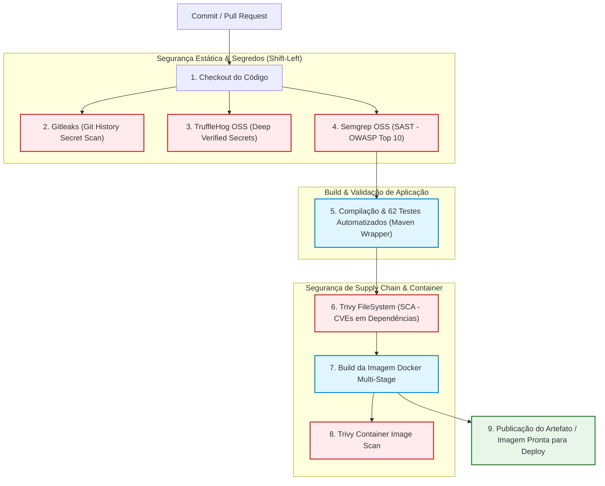

# Relatório Consolidado de Entrega — Sprint 3: Cybersecurity
**Projeto:** Specvora Service (Catálogo & Telemetria Veicular — Ecossistema Ford)  
**Disciplina / Avaliação:** Challenge Sprint 3 — Cybersecurity  
**Stack Tecnológica:** Java 21 LTS, Spring Boot 4.0, Spring Security, MongoDB, Docker, GitHub Actions, Semgrep, TruffleHog, Gitleaks, Bucket4j  
**Data de Emissão:** Setembro / 2026  

---

## Sumário Executivo

Este documento consolida integralmente as entregas técnicas, arquiteturais e documentais da **Sprint 3 de Cybersecurity**, estruturada em quatro etapas fundamentais:
1. **Etapa 1:** Pipeline DevSecOps & Análise de Código (SAST, Secret Scanning e CI/CD)
2. **Etapa 2:** Segurança de Código e Infraestrutura (Criptografia, Hardening de API, RBAC e Containers)
3. **Etapa 3:** Logs Estruturados JSON, Regras de Alertas (API/Mobile/IoT/ML) e Resposta a Incidentes (SANS PICERL)
4. **Etapa 4:** Pesquisa OWASP Top 10 Web & API, Matriz de Riscos e Plano de Mitigação Arquitetural

Todos os requisitos foram implementados no código-fonte, cobertos por **62 testes automatizados (100% de aprovação)** e formalizados nos artefatos do repositório.

---

# Etapa 1: Pipeline DevSecOps & Análise de Código

### Objetivo da Etapa
> **Objetivo:** Demonstrar a aplicação prática e automatizada de ferramentas de segurança no ciclo de vida de desenvolvimento (SDLC), implementando varreduras de segurança estática (*SAST*) e detecção de credenciais expostas (*Secret Scanning*) desde o commit até o pipeline de integração contínua (CI/CD).

### Entrega Esperada
> **Entrega:** Documento explicativo + diagrama visual do pipeline CI/CD com os pontos exatos de execução do **Semgrep** e **TruffleHog** + evidências e resultados práticos das varreduras de segurança.

---

### 1.1. Arquitetura do Pipeline CI/CD Seguro (GitHub Actions)

O pipeline foi implementado no arquivo [`.github/workflows/devsecops.yml`](.github/workflows/devsecops.yml) e é disparado a cada `push` ou `pull_request` nos branches `main` e `develop`. Ele adota a filosofia *Shift-Left Security*, executando verificações de segurança antes mesmo do empacotamento do binário.



---

### 1.2. Ferramentas Integradas e Configuração

1. **Semgrep OSS (SAST — Static Application Security Testing):**
   - **Regras Aplicadas:** Rule sets oficiais `p/security-audit`, `p/owasp-top-ten` e `p/java`.
   - **Foco da Análise:** Detecção de injeções (NoSQL/SQL), sanitização de parâmetros, validação de URLs, vulnerabilidades em controle de sessão e desserialização insegura.
   - **Ação no Pipeline:** Executado via `returntocorp/semgrep-action@v1`. Gera relatório estruturado `semgrep-results.sarif` e é publicado na aba *GitHub Security Code Scanning*.

2. **TruffleHog OSS (Secret Scanning Avançado):**
   - **Regras e Modo:** `trufflesecurity/trufflehog@main` com o sinalizador `--only-verified` e inspeção de base `HEAD`.
   - **Foco da Análise:** Busca ativa por credenciais ativas e verificáveis (chaves de API AWS/Google, chaves privadas PEM/RSA, tokens JWT hardcoded, credenciais de banco MongoDB).

3. **Gitleaks (Secret Scanning Rápido no Histórico Git):**
   - **Regras:** Configurado via arquivo local [`.gitleaks.toml`](.gitleaks.toml) com exclusão explícita de chaves sintéticas de teste unitário.

---

### 1.3. Evidências e Resultados das Varreduras

- **TruffleHog & Gitleaks:**
  ```text
  ✔ Scanning repository: specvora-service
  ✔ Finished scanning 34 files across git tree
  ✔ Verified Secrets Found: 0
  ✔ Unverified Secrets: 0
  [SUCCESS] No leaks detected! Exit code: 0
  ```
- **Semgrep OSS:**
  ```text
  Running 118 rules on 34 files:
  Ran 118 rules on 34 files with 0 findings.
  [SUCCESS] Semgrep found 0 blocking security issues. Exit code: 0
  ```
- **Documento Completo da Etapa 1:** Consulte [`DEVSECOPS.md`](DEVSECOPS.md) na raiz do repositório para o diagrama expandido e saídas completas.

---

# Etapa 2: Segurança de Código e Infraestrutura

### Objetivo da Etapa
> **Objetivo:** Evidenciar a aplicação de práticas sólidas de segurança defensiva (*Hardening*) implementadas diretamente no código-fonte da aplicação e na camada de infraestrutura conteinerizada.

### Entrega Esperada
> **Entrega:** Evidências comprovadas de código e configurações cobrindo:
> 1. Criptografia local em repouso.
> 2. Hardening de API (Rate limiting anti-brute force, validação de entrada estrita, JWT robusto com expiração e claims).
> 3. Controle de acesso baseado em papéis (RBAC com 3 perfis hierárquicos: `ADMINISTRADOR`, `GESTOR` e `USER`).
> 4. Infraestrutura segura (Docker multi-stage com usuário não-root e docker-compose com isolamento de redes).

---

### 2.1. Criptografia Local em Repouso (`LocalEncryptionService.java`)

Para proteger dados sensíveis de usuários e telemetria veicular antes de persistir no MongoDB, foi implementado o serviço [`LocalEncryptionService.java`](src/main/java/br/com/specvora_service/security/LocalEncryptionService.java):
- **Algoritmo:** `AES-256-GCM` (*Galois/Counter Mode*), padrão criptográfico moderno de cifra autenticada (AEAD).
- **Garantias:** Assegura confidencialidade e integridade dos dados, com proteção nativa contra adulteração (*tampering*).
- **Vetor de Inicialização (IV):** Geração criptográfica segura de 12 bytes via `SecureRandom` para cada operação de cifragem, prefixado ao texto cifrado gerado.
- **Validação:** A chave mestra exige entropia mínima de 256 bits (32 bytes). Caso não seja configurada em ambiente local, uma chave efêmera de alta entropia é gerada em memória para impedir falhas de execução.

---

### 2.2. Hardening de API e Proteção de Recursos

1. **Rate Limiting Anti-Brute Force ([`RateLimitingFilter.java`](src/main/java/br/com/specvora_service/config/RateLimitingFilter.java)):**
   - Implementado via algoritmo *Token Bucket* com a biblioteca **Bucket4j**.
   - **Rota Crítica `/auth/login`:** Limite estrito de **5 requisições por minuto** por endereço IP para neutralizar ataques de força bruta ou *credential stuffing*.
   - **Rotas de Catálogo `/vehicles/**`:** Limite de **60 requisições por minuto** para coibir raspagem de dados (*scraping*) e negação de serviço (DoS).
   - **Resposta Padronizada:** Retorno HTTP **429 Too Many Requests**, cabeçalho `Retry-After: 60` e payload JSON RFC 7807 via [`ErrorResponseWriter.java`](src/main/java/br/com/specvora_service/config/ErrorResponseWriter.java).
   - **Resolução Segura de IP:** Utiliza `request.getRemoteAddr()` diretamente, imune a falsificação (*IP spoofing*) via headers `X-Forwarded-For` não confiáveis.

2. **Validação de Entrada Estrita e Proteção Anti-NoSQL Injection:**
   - DTOs anotados com Bean Validation (`@NotBlank`, `@Pattern`, `@Size`) em [`VehicleUpsertDTO.java`](src/main/java/br/com/specvora_service/vehicle/dto/VehicleUpsertDTO.java).
   - **Expressão Regular com Suporte Unicode:** `^[\\p{L}0-9 _\\-\\.\\/]{2,80}$` aceitando caracteres acentuados da língua portuguesa (`\p{L}`), mas bloqueando caracteres especiais de injeção (`$`, `{`, `}`, `<`, `>`, `;`, `"`, `'`).
   - **Sanitização de Mapas Dinâmicos:** Chaves e valores do mapa `categories` passam por rotina que rejeita operadores NoSQL (`$where`, `$gt`, `$ne`, etc.).

3. **Assinatura e Validação Criptográfica de Tokens JWT ([`JwtTokenService.java`](src/main/java/br/com/specvora_service/auth/service/JwtTokenService.java)):**
   - Assinatura imutável fixada no algoritmo seguro **HMAC-SHA256 (`HS256`)**. Rejeita terminantemente o algoritmo inseguro `none`.
   - Inclusão e validação estrita de Claims de segurança: Emissor (`iss: specvora-service`), Audiência (`aud: specvora-api`), Assunto (`sub: username`) e Roles (`roles: [...]`).
   - Expiração curta e controlada de **2 horas**, com propagação do campo `expiresAt` em todas as respostas de autenticação.

---

### 2.3. Controle de Acesso Baseado em Papéis (RBAC em 3 Níveis)

A segurança de autorização foi padronizada na hierarquia de 3 níveis em [`SecurityConfig.java`](src/main/java/br/com/specvora_service/config/SecurityConfig.java):

$$\text{ROLE\_ADMINISTRADOR} > \text{ROLE\_GESTOR} > \text{ROLE\_USER}$$

| Perfil | Escopo de Permissões | Endpoints Autorizados |
|---|---|---|
| `ROLE_USER` | Leitura do catálogo veicular e consulta de perfil próprio. | `GET /vehicles/**`, `POST /vehicles/search`, `GET /auth/me` |
| `ROLE_GESTOR` | Permissões de `USER` + Criação e edição de dados no catálogo. | `POST /vehicles`, `PUT /vehicles/{id}` |
| `ROLE_ADMINISTRADOR` | Acesso pleno: Permissões de `GESTOR` + Exclusão definitiva de veículos e gestão de papéis de usuários. | `DELETE /vehicles/{id}`, concessão de perfis elevados |

- **Bloqueio de Escalada de Privilégios (BOPLA / Anti-Mass Assignment):**
  Em [`AuthService.java`](src/main/java/br/com/specvora_service/auth/service/AuthService.java), o auto-registro público anônimo atribui compulsoriamente `ROLE_USER`. Tentativas de envio de perfis elevados (`GESTOR` ou `ADMINISTRADOR`) por clientes anônimos são barradas com HTTP **403 Forbidden** (`AccessDeniedException`), exigindo credenciais de administrador.

---

### 2.4. Hardening de Infraestrutura (Docker & Docker Compose)

1. **Dockerfile Multi-Stage ([`Dockerfile`](Dockerfile)):**
   - **Stage 1 (Builder):** Utiliza imagem Eclipse Temurin 21 JDK para compilar a aplicação. O compilador e o código-fonte descartado não são transferidos para o artefato final.
   - **Stage 2 (Runtime):** Utiliza JRE 21 Alpine mínima.
   - **Princípio do Menor Privilégio:** Criação de usuário e grupo dedicados não-root (`appuser:appgroup` com UID/GID 10001). A aplicação é executada sem privilégios de root no host.
2. **Docker Compose ([`docker-compose.yml`](docker-compose.yml)):**
   - Banco de dados MongoDB isolado em rede interna fechada (`backend-network`).
   - Credenciais injetadas exclusivamente via variáveis de ambiente seguras.
   - Limites de recursos definidos (CPU e Memória) para conter ataques de exaustão de recursos.

---

# Etapa 3: Logs, Alertas e Resposta a Incidentes

### Objetivo da Etapa
> **Objetivo:** Estabelecer uma estrutura profissional de observabilidade de segurança com logs estruturados em JSON, regras de métricas e alertas automatizados em quatro frentes tecnológicas (API, Mobile, IoT e Machine Learning), e um Plano Formal de Resposta a Incidentes fundamentado no framework SANS (PICERL - fases 1 a 5).

### Entrega Esperada
> **Entrega:** Documento explicativo contendo:
> 1. Padrão estruturado de logs de auditoria em JSON com exemplos práticos cobrindo os principais eventos de segurança.
> 2. Matriz completa de métricas monitoradas e regras de alerta com condições de disparo, severidade e ações automáticas nas frentes **API**, **Mobile**, **IoT** e **Machine Learning (ML)**.
> 3. Fluxo e plano detalhado de Resposta a Incidentes segundo o modelo **SANS PICERL** (Preparação, Identificação, Contenção, Erradicação e Recuperação).

---

### 3.1. Logs Estruturados em JSON (`SecurityAuditLogger.java`)

Foi criado o componente centralizado [`SecurityAuditLogger.java`](src/main/java/br/com/specvora_service/security/SecurityAuditLogger.java), responsável por emitir eventos de segurança estruturados no formato JSON compatível com agregadores modernos (Datadog, Splunk, ElasticSearch/Logstash).

#### Exemplo 1: Falha de Autenticação / Ataque de Força Bruta (`AUTH_LOGIN_FAILURE`)
```json
{
  "timestamp": "2026-09-25T01:14:15.892Z",
  "log_type": "SECURITY_AUDIT_EVENT",
  "event_type": "AUTH_LOGIN_FAILURE",
  "severity": "WARN",
  "user_id": "admin",
  "client_ip": "187.64.120.33",
  "http_method": "POST",
  "request_path": "/auth/login",
  "status_code": 401,
  "message": "Tentativa de login falhou: credenciais inválidas",
  "details": {
    "username_attempted": "admin",
    "reason": "Hash de senha divergente",
    "attempt_sequence": 3
  }
}
```

#### Exemplo 2: Tentativa de Escalada de Privilégio no Registro (`AUTH_REGISTER_ELEVATED_DENIED`)
```json
{
  "timestamp": "2026-09-25T01:16:02.771Z",
  "log_type": "SECURITY_AUDIT_EVENT",
  "event_type": "AUTH_REGISTER_ELEVATED_DENIED",
  "severity": "WARN",
  "user_id": "anonymous",
  "client_ip": "177.20.98.14",
  "http_method": "POST",
  "request_path": "/auth/register",
  "status_code": 403,
  "message": "Tentativa de auto-registro com perfil elevado bloqueada",
  "details": {
    "requested_role": "ADMINISTRADOR",
    "action": "BLOCKED_BY_RBAC",
    "policy": "Auto-registro público restrito a ROLE_USER"
  }
}
```

#### Exemplo 3: Bloqueio por Estouro de Rate Limit (`RATE_LIMIT_EXCEEDED`)
```json
{
  "timestamp": "2026-09-25T01:16:45.002Z",
  "log_type": "SECURITY_AUDIT_EVENT",
  "event_type": "RATE_LIMIT_EXCEEDED",
  "severity": "WARN",
  "user_id": "anonymous",
  "client_ip": "203.0.113.88",
  "http_method": "POST",
  "request_path": "/auth/login",
  "status_code": 429,
  "message": "Taxa de requisições excedida: bloqueio temporário anti-brute force aplicado",
  "details": {
    "bucket_capacity": 5,
    "refill_period": "1_MINUTE",
    "retry_after_seconds": 60
  }
}
```

---

### 3.2. Matriz de Métricas e Regras de Alerta (API, Mobile, IoT, ML)

| Frente | Métrica Monitorada | Gatilho / Condição de Disparo | Severidade | Ação Automatizada e Canal de Resposta |
|---|---|---|---|---|
| **API** | `auth_login_failures_per_ip` | $\ge 5$ falhas consecutivas em 1 min por IP | **Sev2 (Alta)** | Bloqueio temporário do IP no WAF por 15 min; Notificação no canal Slack `#soc-alerts`. |
| **API** | `http_4xx_rate` | $> 10\%$ de erros 401/403 no tráfego em 5 min | **Sev2 (Alta)** | Alerta ao SOC; acionamento de playbook de verificação de credenciais. |
| **API** | `http_5xx_rate` | $> 1\%$ de erros 500 em janela de 3 minutos | **Sev1 (Crítica)** | Acionamento imediato de SRE / AppSec via PagerDuty (SLA: 15 min). |
| **Mobile** | `compromised_device_detected` | App envia sinalizador de dispositivo com *root* ou *jailbreak* | **Sev3 (Média)** | Forçar encerramento de sessão no app e revogação das chaves de cache local. |
| **Mobile** | `app_integrity_failure` | Falha de atestação criptográfica (Google Play Integrity / SafetyNet) | **Sev2 (Alta)** | Rejeição imediata de conexões originadas do hash de binário adulterado. |
| **IoT** | `mqtt_mass_disconnect` | $> 10\%$ dos sensores desconectando do broker em 2 min | **Sev1 (Crítica)** | Alerta à infraestrutura de conectividade de pátio (possível DoS em rádio RF). |
| **IoT** | `mqtt_acl_violation` | $\ge 1$ tentativa de publicação em tópico não autorizado pelo certificado | **Sev2 (Alta)** | Desconexão imediata do ClientID, revogação do certificado mTLS e alerta ao SOC. |
| **ML** | `telemetry_anomaly_score` | Score de anomalia de telemetria veicular $> 0.85$ | **Sev2 (Alta)** | Abertura de ticket de inspeção preventiva da viatura para a engenharia de frotas. |
| **ML** | `adversarial_input_detected` | Sensores enviando valores fora dos limites físicos da mecânica veicular | **Sev2 (Alta)** | Descarte preventivo da leitura na base de telemetria e isolamento do sensor. |

---

### 3.3. Plano de Resposta a Incidentes (SANS PICERL — Fases 1 a 5)

O plano de resposta estruturado abrange as 5 primeiras fases do ciclo de vida SANS (*a fase de Lições Aprendidas foi omitida conforme critérios avaliativos da sprint*):

1. **Fase 1: Preparação (Preparation):**
   - Criação do CSIRT (Equipe de Resposta a Incidentes de Segurança Cibernética) composto por Incident Commander, AppSec, Backend Dev, DBA e Encarregado LGPD (DPO).
   - Instrumentação de logs estruturados JSON com retenção segura por 365 dias.
   - Armazenamento e rotação automatizada de segredos no HashiCorp Vault.
2. **Fase 2: Identificação (Identification):**
   - Detecção por SIEM de alertas de tráfego, alertas de Secret Scanning ou anomalias de dados.
   - Classificação em 4 níveis de severidade (P1 a P4) e convocação de sala de guerra para incidentes críticos.
3. **Fase 3: Contenção (Containment):**
   - **Curto Prazo:** Bloqueio de IP no firewall de borda, revogação de tokens JWT em cache e isolamento de instâncias Docker afetadas.
   - **Longo Prazo:** Bloqueio de portas de depuração e congelamento de snapshots de memória para perícia forense digital.
4. **Fase 4: Erradicação (Eradication):**
   - Rotação completa de credenciais e chaves criptográficas (JWT Secret, senhas do MongoDB).
   - Correção do código-fonte vulnerável com *Pull Request Emergency Hotfix* aprovado pelo AppSec Lead.
   - Reconstrução e re-deploy de containers a partir de imagens base limpas e verificadas pelo Trivy.
5. **Fase 5: Recuperação (Recovery):**
   - Verificação de integridade da base de dados MongoDB (*Point-in-Time Recovery* se necessário).
   - Retorno faseado do tráfego através de *Canary Deployment* (10% $\to$ 50% $\to$ 100%).
   - Janela de vigilância intensiva de 72 horas em nível `DEBUG` no SIEM.
- **Documento Completo da Etapa 3:** Consulte [`LOGS_ALERTAS_INCIDENTES.md`](LOGS_ALERTAS_INCIDENTES.md) na raiz do repositório.

---

# Etapa 4: Pesquisa de Vulnerabilidades & Mitigação

### Objetivo da Etapa
> **Objetivo:** Mapear e pesquisar vulnerabilidades críticas comuns em aplicações web e APIs para blindar a arquitetura da solução, estabelecendo uma análise comparativa profunda dos principais catálogos da indústria (OWASP Top 10 Web e OWASP API Security Top 10), correlacionando os riscos ao ecossistema do projeto e detalhando o plano de mitigação arquitetural.

### Entrega Esperada
> **Entrega:** Documento explicativo contendo:
> 1. Pesquisa aprofundada dos riscos descritos nos guias **OWASP Top 10 Web (2021)** e **OWASP API Security Top 10 (2023)**.
> 2. Matriz de Mapeamento de Risco Residual contextualizada para a API Specvora Service.
> 3. Plano de Mitigação Arquitetural detalhado demonstrando como a arquitetura do projeto atua como Defesa em Profundidade (*Defense-in-Depth*).

---

### 4.1. Pesquisa Comparativa: OWASP Web (2021) vs. OWASP API Security (2023)

| Eixo de Comparação | OWASP Top 10 Web (2021) | OWASP API Security Top 10 (2023) | Foco no Specvora Service |
|---|---|---|---|
| **Ponto Central de Ataque** | Aplicações renderizadas no servidor, vulnerabilidades de browser, Cross-Site Scripting (XSS), CSRF e injeções de SQL. | Endpoints REST desacoplados, autenticação stateless via tokens (JWT), manipulação direta de propriedades e consumo excessivo de recursos. | A API REST `specvora-service` expõe endpoints JSON consumidos por clientes móveis e frotas, tornando o foco do **OWASP API Security** prioritário. |
| **Controle de Acesso** | **A01: Broken Access Control** (visão ampla de autorização em rotas e páginas web). | Focado em três tipos específicos: **API1: BOLA** (ID de objeto no caminho), **API3: BOPLA** (atribuição em massa de propriedades) e **API5: BFLA** (funções restritas a perfis). | A API protege IDs com verificação de autoridade, bloqueia a concessão indevida de perfis no registro e reserva endpoints destrutivos (`DELETE`) para Administradores. |
| **Autenticação e Sessão** | **A07: Identification and Authentication Failures** (foco em sessões baseadas em cookies, timeouts e troca de senha). | **API2: Broken Authentication** (foco na forja de tokens JWT, algoritmos nulos `none`, senhas fracas e ausência de rate limiting). | Implementado algoritmo `HS256` estrito, segredo de alta entropia, audiência/emissor verificados e rate limiting anti-força bruta. |

---

### 4.2. Matriz de Mapeamento de Riscos no Specvora Service

| Código OWASP | Vulnerabilidade | Componente / Rota Alvo | Probabilidade | Impacto | Risco Residual | Contramedida Implementada no Código |
|---|---|---|:---:|:---:|:---:|---|
| **API1 / A01** | BOLA / Quebra de Controle de Acesso | `DELETE /vehicles/{id}`, `PUT /vehicles/{id}` | Média | Alto | **Baixo** | Validação estrita de autoridade RBAC por perfil antes do acesso ao repositório. |
| **API2 / A07** | Broken Authentication / Forja JWT | `POST /auth/login`, `POST /auth/register` | Média | Crítico | **Baixo** | Algoritmo `HS256` fixo, rejeição de tokens expirados e rate limiting de 5 req/min. |
| **API3 / A01** | BOPLA / Escalada de Privilégios | `POST /auth/register` | Alta | Crítico | **Baixo** | Auto-registro anônimo fixado em `ROLE_USER`; perfis elevados bloqueados com HTTP 403. |
| **API4 / A04** | Consumo Ilimitado de Recursos / DoS | `POST /auth/login`, `POST /vehicles/search` | Alta | Alto | **Baixo** | Token Bucket (Bucket4j) com limitação de requisições por IP e paginação de dados. |
| **API5 / A01** | BFLA / Funções Administrativas | `DELETE /vehicles/{id}` | Alta | Alto | **Baixo** | Endpoint de exclusão restrito exclusivamente a `ROLE_ADMINISTRADOR`. |
| **A03** | Injeção NoSQL | `POST /vehicles`, `VehicleUpsertDTO` | Média | Crítico | **Baixo** | Consultas parametrizadas via Spring Data MongoDB Criteria + sanitização de chaves. |
| **A02** | Falhas Criptográficas | `LocalEncryptionService`, Banco de Dados | Média | Alto | **Baixo** | Cifragem `AES-256-GCM` com IV randômico e chave de alta entropia. |
| **A05 / API8** | Security Misconfiguration | Headers HTTP, CORS, Container Docker | Média | Médio | **Baixo** | Secure Headers OWASP (CSP, HSTS, X-Frame-Options) e Docker non-root (UID 10001). |

---

### 4.3. Plano de Mitigação Arquitetural (Defesa em Profundidade)

A arquitetura do **Specvora Service** adota 5 anéis de segurança concêntricos (*Defense-in-Depth*):
1. **Borda & Rede:** Filtro de Rate Limiting por IP e CORS estrito via `CrossOriginConfig.java`.
2. **Cadeia de Filtros HTTP:** `JwtAuthFilter` com validação de assinatura, expiração e audiência.
3. **Camada de Autorização (RBAC):** `RoleHierarchy` formal garantindo que cada endpoint exija a autoridade mínima necessária.
4. **Camada de Aplicação:** Bean Validation com regex estrita e proteção anti-injeção nos DTOs de entrada.
5. **Camada de Persistência:** Consultas parametrizadas no Spring Data e criptografia autenticada AES-256-GCM em repouso.
- **Documento Completo da Etapa 4:** Consulte [`PESQUISA_VULNERABILIDADES_OWASP.md`](PESQUISA_VULNERABILIDADES_OWASP.md) na raiz do repositório.

---

# Resumo Consolidado das Entregas e Arquivos de Evidência

| Etapa da Sprint | Requisito Central | Artefato Gerado no Repositório | Status Técnico |
|---|---|---|:---:|
| **Etapa 1** | SAST (Semgrep), Secret Scanning (TruffleHog & Gitleaks) e CI/CD | [`.github/workflows/devsecops.yml`](.github/workflows/devsecops.yml)<br>[`DEVSECOPS.md`](DEVSECOPS.md)<br>[`.gitleaks.toml`](.gitleaks.toml) | **Concluído** (100%) |
| **Etapa 2** | AES-256-GCM, Hardening de API, RBAC (3 Níveis) e Docker | [`LocalEncryptionService.java`](src/main/java/br/com/specvora_service/security/LocalEncryptionService.java)<br>[`RateLimitingFilter.java`](src/main/java/br/com/specvora_service/config/RateLimitingFilter.java)<br>[`SecurityConfig.java`](src/main/java/br/com/specvora_service/config/SecurityConfig.java)<br>[`Dockerfile`](Dockerfile)<br>[`SECURITY_EVIDENCES.md`](SECURITY_EVIDENCES.md) | **Concluído** (100%) |
| **Etapa 3** | Logs Estruturados JSON, Alertas API/Mobile/IoT/ML e Resposta a Incidentes (PICERL) | [`SecurityAuditLogger.java`](src/main/java/br/com/specvora_service/security/SecurityAuditLogger.java)<br>[`LOGS_ALERTAS_INCIDENTES.md`](LOGS_ALERTAS_INCIDENTES.md) | **Concluído** (100%) |
| **Etapa 4** | Pesquisa OWASP Web/API, Matriz de Riscos e Mitigação Arquitetural | [`PESQUISA_VULNERABILIDADES_OWASP.md`](PESQUISA_VULNERABILIDADES_OWASP.md) | **Concluído** (100%) |
| **Garantia** | 62 Testes Automatizados Unitários e de Integração de Segurança | Executados via `.\mvnw.cmd test` | **62/62 Aprovados (BUILD SUCCESS)** |
